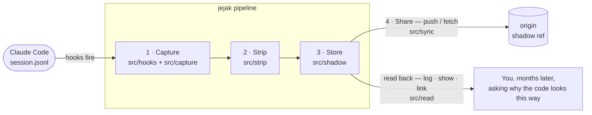
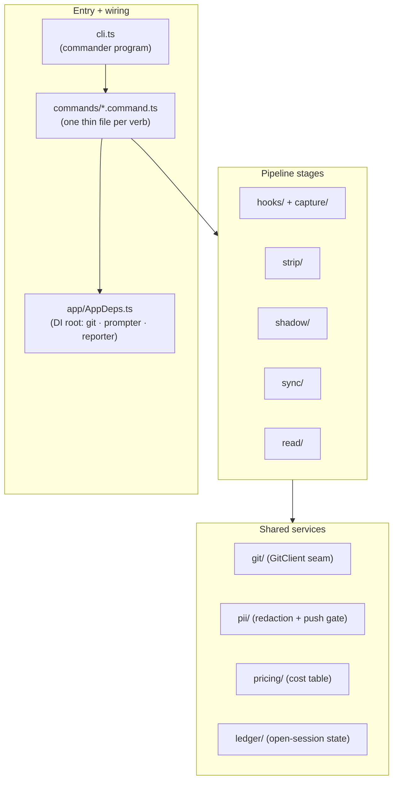
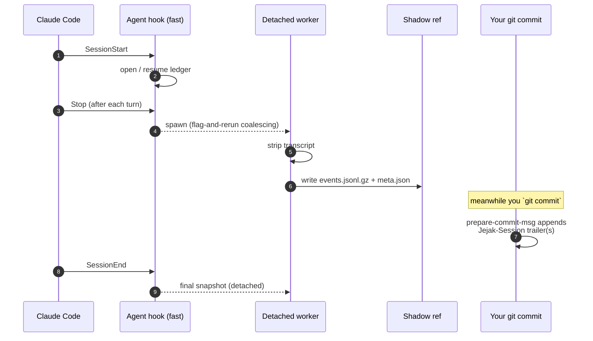
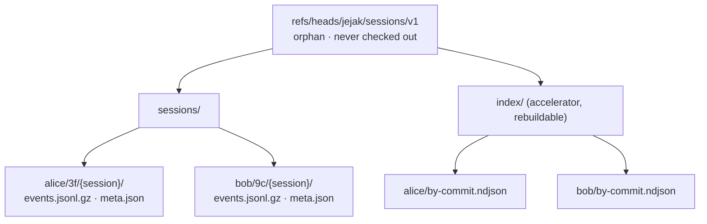
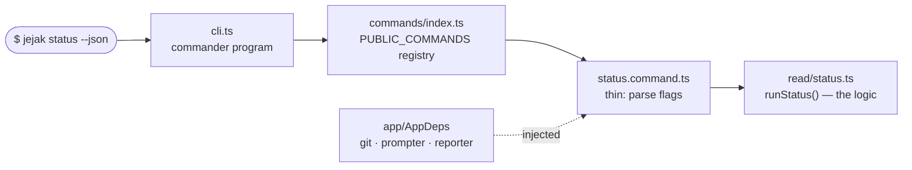

# Jejak — Architecture

High-level architecture for Jejak v0.1. Detail: [DESIGN-LLD.md](DESIGN-LLD.md) (v0.4). Reviews: [REVIEW-LLD-v3.md](REVIEW-LLD-v3.md).

> New here? Read this top-to-bottom — the two diagrams below are the whole mental model. The
> diagrams render on GitHub and on the docs site (`pnpm docs:site:dev`).

## At a glance

Everything jejak does is one left-to-right pipeline. A Claude Code session log goes in; a compact,
shareable trace on a hidden git branch comes out.



| Stage | Question it answers | Where in `src/` |
|---|---|---|
| **Capture** | How do we get the session log off the laptop without slowing the agent? | `hooks/`, `capture/` |
| **Strip** | What's worth keeping, and what's recoverable noise? | `strip/` |
| **Store** | Where do traces live so they travel with the repo but never pollute it? | `shadow/` |
| **Share** | How do ten engineers pool traces without merge conflicts? | `sync/` |
| **Read** | How do you get the story back out? | `read/` |

## Code map

How the folders under `src/` group by role. **Start at `cli.ts`** and follow the arrows.



The key pattern: **commands are thin**. A `*.command.ts` file only parses flags and calls a
`run*()` function in the feature module — so the logic is testable without `commander` or a TTY. See
[§6](#_6-cli-v0-1) for the wiring.

## 1. Capture

Claude Code JSONL at `~/.claude/projects/<project-id>/<session-id>.jsonl`.

### Two hook tiers (Entire-inspired)

**Agent hooks** (Claude Code `.claude/settings.json`):

| Hook | Purpose |
|---|---|
| `SessionStart` | Open/resume ledger; warn on concurrent session |
| `Stop` | Partial snapshot per turn (3s sync) |
| `SessionEnd` | Final capture (detached) |

**Git hooks** (`.git/hooks/`, via `jejak setup`):

| Hook | Purpose |
|---|---|
| `prepare-commit-msg` | Append `Jejak-Session:` trailer(s) for all open sessions (supports concurrent sessions) |

Hooks return <50ms; work runs in detached workers with flag-and-rerun coalescing.

The lifecycle — what fires when, from a session opening to a trace landing on the shadow ref while
your commit gets anchored to it:



The agent hooks (left) and the git hook (`prepare-commit-msg`, right) run independently — that's why
a trace and the commit it produced get linked without either one waiting on the other.

### Fallbacks

- `jejak attach <session-id>` — manual capture when hooks miss (v0.1)
- `jejak watch` (filesystem watcher daemon) — deferred v0.2+

## 2. Strip

**Lossless** strip: keep every line + every field; offload only bulk content (recoverable), drop
nothing — the trace is an analysis substrate (cost / efficiency / quality / feedback), not just a
narrative. **Thinking kept full**; **analytics captured per event** (model, token `usage`,
`stopReason`, `requestId`, sidechain/meta flags, timestamps); session `meta.json` aggregates tokens,
turns, duration, models, and **cost** (from a versioned `src/pricing/` table). Bulk
`tool_result`/`tool_use`/large fields → **content-addressed payload blobs** (preview + sha; expandable,
git-dedup'd). 5–20 MB raw → gzipped narrative ~3–5% of raw; payloads dedup'd separately.

## 3. Store

### Shadow ref

**`refs/heads/jejak/sessions/v1`** — orphan branch, no checkout.

```
sessions/<dev-handle>/<shard:2>/<session-id>/
  events.jsonl.gz
  meta.json
index/<dev-handle>/by-commit.ndjson    ← accelerator, not authoritative
```

**Compression (v0.1):** gzip via `node:zlib`; stored as `events.jsonl.gz`. v0.2 may switch to zstd (`.zst`) if dogfood shows size pressure.

Hash-sharding within per-writer namespace: balanced tree, no archival needed. Each developer owns a
disjoint subtree — which is what makes concurrent pushes conflict-free (see §4):



### Commit anchoring (Δ-1)

**Authoritative:** `Jejak-Session` trailer on git commits (via `prepare-commit-msg`).

**Accelerator:** `index/<handle>/by-commit.ndjson` (breaks on history rewrite).

`jejak link <sha>`: trailer first (returns **list** of sessions), index fallback.

### Storage tiers

**v0.1 (Path A):** one shared shadow ref + local staging at `~/.jejak/staging/`. PII runs before shared write; push hard-gated.

**v0.2 (Path B):** local temp ref + condense at commit time (Entire-style). See DESIGN-LLD §20.

## 4. Conflict-free merges

Layer 1: per-writer paths (`sessions/<handle>/...`).  
Layer 2: append-only index + union merge + explicit concat.  
Layer 3: client-side fetch → merge → plain push + retry.

## 5. Privacy

PII redaction is **best-effort** — 5 built-in block patterns (AWS key, private key, bearer token,
secret assignment, JWT) plus opt-in email, with custom patterns via a zero-dep `.jejak/pii.json`
(deviates from the doc's earlier `.yaml` to avoid a YAML dependency). Secrets are **redacted inline**
and the session is kept (marked `captured-with-blocks`), never silently dropped. Not a guarantee.
Layers: PII scan, local staging, push hard-gate (refuses if the catalog won't load).

## 6. CLI (v0.1)

How a verb is wired — the same shape for all twelve. `cli.ts` iterates the `PUBLIC_COMMANDS`
registry; each command file is thin and delegates to a `run*()` in its feature module:



To add a verb: write `foo.command.ts` (implementing `CommandModule`), add it to `commands/index.ts`,
and put the logic in a feature module. The verb-coverage test (`scripts/expected-verbs.json`) keeps
the registry, docs, and `--help` in sync.

```
jejak init [--agent <id>] / setup [--claude-code] [--force]
jejak uninstall [--purge]              # remove hooks; optional ~/.jejak/<repo-hash>/ purge
jejak active-session-id [--all-open]
jejak attach <session-id> [--force]   # missed sessions; optional HEAD amend
jejak doctor [--trace]
jejak push / fetch                     # PII required before push
jejak log / show / link <sha>          # link returns N sessions
jejak status
```

**Guards:** `jejak init` / `jejak setup` refuse self-setup in the jejak dev repo. Any repo with `.jejak/disabled` makes hooks no-op. See DESIGN-LLD §9.1.

**Deferred to v0.2+:** `jejak watch` (filesystem-watcher fallback), `jejak capture --session`, pre-turn diff, Cursor adapter, `Jejak-Attribution` trailer.

## 7. Build order

Execution order for development: [IMPLEMENTATION-ORDER.md](IMPLEMENTATION-ORDER.md) (items 0–6). Design-level sequence below maps to those items.

1. Reader + stripper + golden tests  
2. shadow_branch (Finn lift, hash-shard paths)  
3. jejak init + git hooks (trailers)  
4. Agent hooks + worker + staging  
5. PII dispatcher (**gate**)  
6. push/fetch  
7. doctor + trace + attach  
8. show / log / link  
9. uninstall  
10. Dogfood **4 weeks**, 5–10 engineers  

## 8. Open input

**Dogfood cohort roster** — see DESIGN-LLD §20 Q3. Everything else resolved per REVIEW-LLD-v2.
