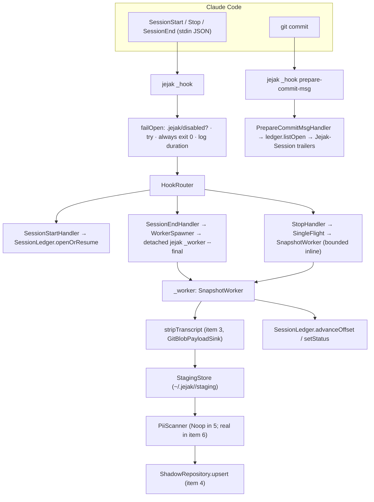
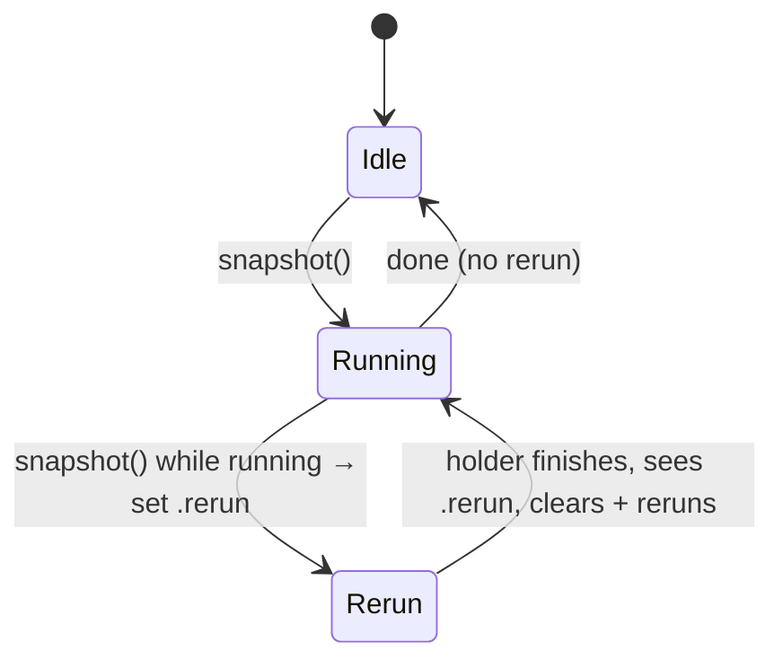
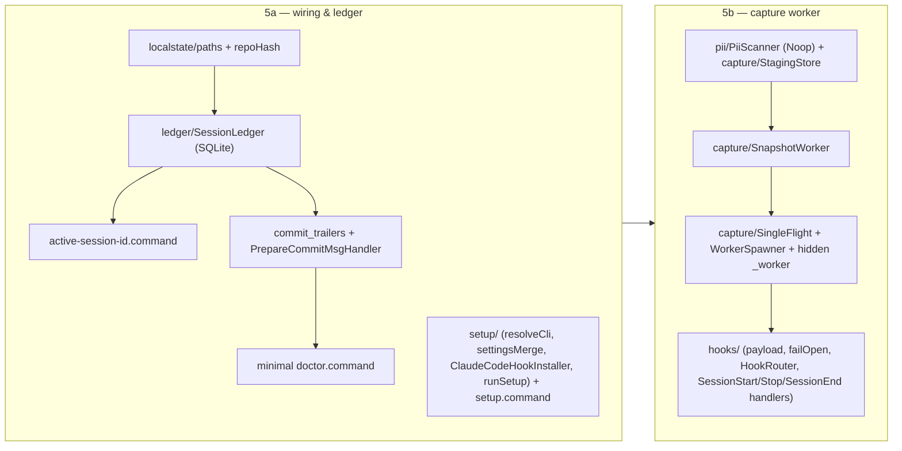

# Item 5 — Capture loop (hooks + worker) implementation plan

> The item that makes capture actually fire. Wires Claude Code → jejak hooks, records sessions in
> a ledger, and runs the strip→stage→upsert pipeline (items 3+4) automatically — fail-open, fast,
> and never touching the developer's working tree. Pattern-based and **phased (5a → 5b)**.

## Context

Today `jejak setup` and the `_hook` commands are stubs, so nothing captures. Item 5 closes the
loop: `jejak setup --claude-code` installs the agent + git hooks; Claude Code events drive a
detached worker that strips the transcript (item 3) and upserts it to the shadow ref (item 4).

- **Tracks:** [IMPLEMENTATION-ORDER §5](../IMPLEMENTATION-ORDER.md) · **Design:** DESIGN-LLD §5 (lifecycle), §6 (hook contract + async worker), §9.1 (self-setup + `.jejak/disabled`), §10.5 (trailers), §14 (ledger), §16.5 (active-session-id) · LESSONS-FROM-FINN §2–§4
- **Builds on:** item 3 (`stripTranscript`), item 4 (`ShadowRepository.upsert`, `GitBlobPayloadSink`), init (`ModeStrategy`, agent registry, `GuardStep`).
- **Verbs:** `jejak setup --claude-code`, `jejak active-session-id`, minimal `jejak doctor`, + hidden `_hook *` / `_worker`.

### Non-negotiable invariants (DESIGN-LLD §6.1, §9.1, LESSONS §3)
1. **Fail-open:** every hook exits **0** no matter what; a capture failure never blocks the agent or the commit.
2. **`.jejak/disabled` first:** every hook checks for it at repo root and exits 0 immediately if present.
3. **<50 ms hooks:** real work runs **detached** (`SessionStart`/`SessionEnd`); only `Stop` does a **bounded (~3 s) inline** snapshot.
4. **Never checkout the shadow ref** (item 4 already guarantees this); capture never stages files or commits on the dev's branch.
5. **Capture stays local in item 5** — the shadow ref is written but **not pushed**; PII scan + push hard-gate are **item 6**, so nothing leaves the machine before redaction exists.

### Scope split

| Phase | Scope |
|---|---|
| **5a — wiring & ledger** | `jejak setup` (mode-aware, no-clobber merge, git hook, self-refusal), `SessionLedger` (SQLite), `active-session-id`, `prepare-commit-msg` trailers, `.jejak/disabled`, minimal `doctor` |
| **5b — capture worker** | agent hook handlers, detached `SnapshotWorker` (strip→stage→upsert), single-flight flag-and-rerun, staging + cleanup, offset resume, `PiiScanner` seam (Noop) |

Trailers (5a) are inert until the ledger has open sessions (5b) — safe to ship first (DESIGN-LLD §19 S3b note).

### Deferred to item 6
PII dispatcher + scan + **push hard-gate**, `push`/`fetch`, full `doctor --trace`, `show`/`log`/`link`, `attach`, `uninstall`. The worker has a `PiiScanner` seam (item 5 injects a `NoopPiiScanner`); item 6 implements the real one.

---

## 1. Design patterns

| Pattern | Applied to | Why |
|---|---|---|
| **Command (module-per-verb)** | graduate `setup`/`active-session-id`/`doctor` to own `*.command.ts`; `_hook`/`_worker` via a router | keeps `cli.ts`/`internal.ts` thin |
| **Command + Registry** | `hooks/HookRouter` maps `_hook <event>` → a `HookHandler` | add an event = a new handler file |
| **Adapter + Registry** | `agents/` gains a `HookInstaller` per agent (`ClaudeCodeHookInstaller`) | Cursor later = new installer; setup orchestration unchanged |
| **Strategy** | `ModeStrategy.hookCommand()` — project `npx jejak` vs global embedded path | the project/global divergence stays in two files |
| **Pipeline** | `setup/runSetup` steps; `SnapshotWorker` (read→strip→stage→upsert) reuses items 3+4 | composable, testable stages |
| **Repository** | `SessionLedger` (SQLite), `StagingStore` (fs), local-state paths | persistence behind intent-named methods |
| **Facade** | `GitClient` (have); `ClaudeHookPayload` parser; `WorkerSpawner` (detached-spawn seam) | one seam each; mockable |
| **Decorator** | `failOpen()` wraps every handler: `.jejak/disabled` check + always-exit-0 + duration log | the cross-cutting invariant in one place |
| **Dependency Injection** | ledger, git, clock, spawner, fs, scanner injected into handlers + worker | unit tests use fakes — no real Claude, no detached process, no SQLite-on-disk needed |

---

## 2. Module layout

```
src/
├── commands/
│   ├── setup.command.ts            # REAL (was stub)
│   ├── active-session-id.command.ts
│   ├── doctor.command.ts           # minimal (setup checks only)
│   └── internal.ts                 # wire _hook router + hidden _worker
├── setup/
│   ├── runSetup.ts                 # pipeline: guard → resolve CLI → install hooks → report
│   ├── resolveCli.ts               # JEJAK_CLI per ModeStrategy (npx vs abs path)
│   ├── HookInstaller.ts            # interface { install(ctx): InstallReport }
│   ├── ClaudeCodeHookInstaller.ts  # merge .claude/settings.json + write git hook
│   └── settingsMerge.ts            # additive merge + conflict detection (NEVER clobber)
├── hooks/
│   ├── HookRouter.ts               # event → HookHandler
│   ├── HookHandler.ts              # interface { run(payload, deps) }
│   ├── failOpen.ts                 # disabled-check + always-exit-0 + dispatch-log timing
│   ├── payload.ts                  # parse Claude hook stdin JSON
│   ├── SessionStartHandler.ts      # open/resume ledger; concurrent-session warning (inline, fast)
│   ├── StopHandler.ts              # bounded (~3 s) inline snapshot via single-flight
│   ├── SessionEndHandler.ts        # spawn detached final worker
│   └── PrepareCommitMsgHandler.ts  # one Jejak-Session trailer per open session
├── capture/
│   ├── SnapshotWorker.ts           # read(offset)→strip→stage→upsert→advance offset
│   ├── WorkerSpawner.ts            # detached `jejak _worker` (setsid/detached, stdio ignore, unref)
│   ├── SingleFlight.ts             # flag-and-rerun lock (C-4)
│   └── StagingStore.ts             # ~/.jejak/<repo-hash>/staging/<session>/
├── ledger/
│   ├── SessionLedger.ts            # better-sqlite3 repository (open/resume/advance/setStatus/listOpen)
│   └── schema.ts                   # DDL + row types + status enum
├── localstate/
│   └── paths.ts                    # repoHash(repoRoot) → ~/.jejak/<repo-hash>/{ledger.db,staging,locks,dispatch.log}
├── pii/
│   └── PiiScanner.ts               # interface + NoopPiiScanner (item 6 implements the real catalog)
├── commit_trailers.ts              # interpret-trailers helper (graduate stub)
└── doctor.ts                       # minimal setup checks (graduate stub)
adapters/claude-code/                # templates already exist (settings.json.template, git-hooks/prepare-commit-msg)
```

---

## 3. Component & data flow



---

## 4. Hook lifecycle (sequence)

```mermaid
sequenceDiagram
  participant CC as Claude Code
  participant H as jejak _hook
  participant L as SessionLedger
  participant W as SnapshotWorker
  CC->>H: SessionStart {session_id, transcript_path, cwd, source}
  H->>L: openOrResume (captured→open on resume); warn if other open
  Note over H: returns <50ms (no snapshot yet)
  CC->>H: Stop {…}  (per turn)
  H->>W: bounded inline snapshot via SingleFlight (rerun-flag if busy)
  W->>W: strip from ledger.offset → stage → upsert → advance offset
  CC->>H: SessionEnd {…}
  H->>H: spawn DETACHED `jejak _worker --session <id> --final`
  Note over H: returns immediately
  CC->>H: (later) git commit → prepare-commit-msg
  H->>L: listOpen → emit one `Jejak-Session:` trailer each (exit 0 always)
```

**Single-flight (C-4, flag-and-rerun):**



---

## 5. Key mechanics (locked)

- **Hook entry:** `jejak _hook <event>` reads the Claude payload JSON from **stdin**; `payload.ts`
  normalizes `{ sessionId, transcriptPath, cwd, source }`. `failOpen` resolves repoRoot, checks
  `.jejak/disabled` (exit 0), runs the handler in try/catch (always exit 0), logs `{hook, session_id,
  duration_ms}` to `~/.jejak/<hash>/dispatch.log` (feeds `doctor --trace`, item 6).
- **Detached spawn (LESSONS §3):** `WorkerSpawner` runs `jejak _worker …` with `detached:true`,
  `stdio:'ignore'`, `.unref()` — survives the hook's exit; `Stop` instead runs the worker **inline**
  (bounded by Claude's 3 s hook timeout).
- **Worker:** load ledger row (offset, transcriptPath, handle from init's chain); `stripTranscript`
  from `fromOffset` with a `GitBlobPayloadSink`; append events to staging; `PiiScanner.scan` (Noop);
  `ShadowRepository.upsert`; **advance `last_offset` even if blocked** (LESSONS §4.6 — never re-fail
  the same bytes forever). On `--final`: poll `git log --grep "Jejak-Session: <id>"` for `commit_sha`,
  write final `meta.json` (status `captured`), then `rm -rf staging/<session>` on success.
- **Setup (mode-aware, no-clobber):** require `.jejak/config.json` (init done) and `config.agent ==
  claude-code`; self-setup refusal (reuse `GuardStep`); resolve `JEJAK_CLI` via
  `ModeStrategy.hookCommand()` (project `npx jejak`, global `process.execPath`/`which jejak`);
  `settingsMerge` adds jejak's hooks to `.claude/settings.json` **additively** — idempotent if already
  present, keeps foreign hooks, and **aborts with guidance on a real conflict** (never clobbers); write
  `.git/hooks/prepare-commit-msg` (chmod +x) unless a non-jejak one exists (then guide). Bare `setup`
  → exit 2; agent mismatch → exit 1.
- **Ledger (SQLite, per-repo at `~/.jejak/<hash>/ledger.db`):** `sessions(session_id PK, status,
  transcript_path, last_offset, started_at, ended_at, commit_sha, branch, event_count)`; status ∈
  `open|captured|captured-with-blocks|failed`. Methods: `openOrResume`, `advanceOffset`, `setStatus`,
  `listOpen`, `mostRecentOpen`.
- **Single git seam:** the trailer's `git interpret-trailers` and the commit-poll `git log --grep`
  go through `GitClient` (new typed methods) — item 5 adds no second seam alongside the facade.
- **active-session-id:** `mostRecentOpen` (one line) / `--all-open` (one per line, for prepare-commit-msg).
- **Minimal doctor:** report agent hooks present in `.claude/settings.json`, git hook installed,
  ledger DB exists, `.jejak/disabled` presence, orphan staging/locks. (Full `--trace` = item 6.)

---

## 6. Build order



---

## 7. Testing (DI makes the un-testable testable)

- **Unit (no real Claude / SQLite-on-disk / detached process):**
  - `SessionLedger` against an in-memory SQLite (`better-sqlite3(':memory:')`): open/resume
    (captured→open), advanceOffset, listOpen, mostRecentOpen.
  - `settingsMerge`: fresh file; idempotent re-merge; preserves a foreign hook; **detects a conflict
    and refuses** (no clobber).
  - `resolveCli`: project → `npx jejak`; global → embedded path.
  - `payload.ts`: parses Claude stdin JSON; tolerates junk.
  - `failOpen`: `.jejak/disabled` → exit 0 without running; handler throw → still exit 0; duration logged.
  - `SingleFlight`: second call while running sets rerun; holder reruns once.
  - `SnapshotWorker` with a `FakeGitClient` + fake ledger + a fixture transcript: strips from offset,
    stages, upserts, advances offset (and advances even when the (fake) scanner blocks).
  - `PrepareCommitMsgHandler`: N open sessions → N trailers; zero → no-op; always exit 0.
- **Integration (real git temp repo + a synthetic transcript, FakePrompter, no real Claude):**
  - `jejak setup --claude-code` writes `.claude/settings.json` hooks + executable
    `.git/hooks/prepare-commit-msg`; idempotent; refuses self-setup; bare → exit 2; mismatch → exit 1.
  - End-to-end: drive `_hook session-start` then `_hook stop` (with a fixture transcript path) then
    `_hook session-end`; assert the session landed on the shadow ref (reuse item-4 read-back) and the
    ledger shows `captured`; working tree untouched. **Inject a synchronous `WorkerSpawner`** so the
    detached `SessionEnd` path runs inline — the test never waits on a background process.
  - `prepare-commit-msg` on a real commit with an open session → commit message carries the trailer;
    `jejak link`-style `git log --grep` finds it. With `.jejak/disabled` present → no trailer, exit 0.
- `pnpm test`/`lint`/`typecheck`/`docs:gen` (no drift). New deps: none (better-sqlite3 already present).

---

## 8. Doc reconciliation
- **CLI-SPEC** — `setup` `stub → shipped`; `active-session-id` shipped; minimal `doctor` noted; capture-loop user flow.
- **DESIGN-LLD §5/§6/§14** — fill in concrete handler/worker/ledger module names (`src/hooks`, `src/capture`, `src/ledger`); §6.3 hook command shape already matches the committed templates.
- **IMPLEMENTATION-ORDER §5** — tick Done-when across 5a/5b; record results after the test-project run.
- **docs/user/** — a `setup.md` page (shipped public verb → docs-coverage requires it); likely a `capture` concept page (with a bound `sources_hash`).

## 9. Deferred (item 6+)
PII catalog + scan + **push hard-gate** (the `PiiScanner` seam is filled here) · `push`/`fetch` ·
full `doctor --trace` · `show`/`log`/`link` · `attach` · `uninstall` · pre-turn diff (v0.2) · Cursor installer.
