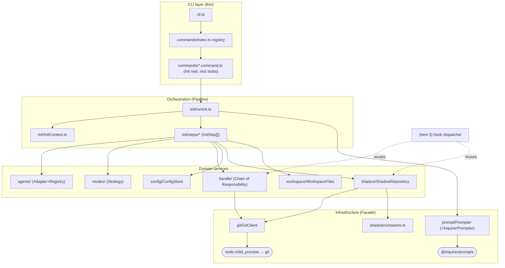
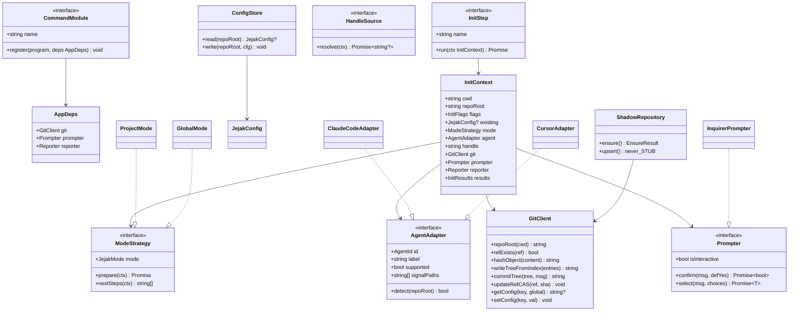
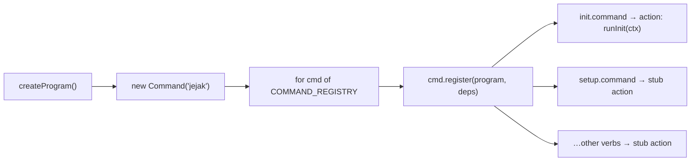
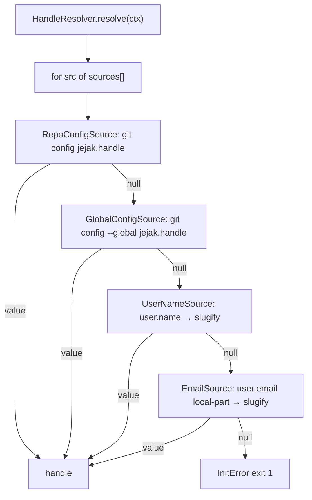
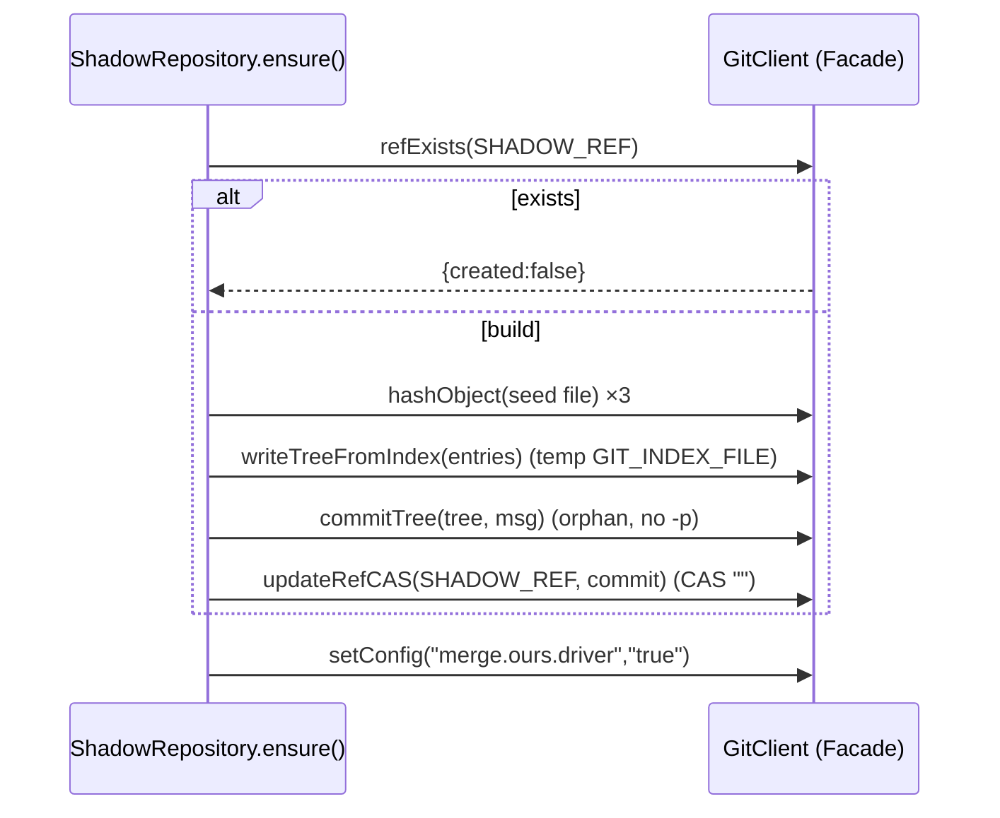
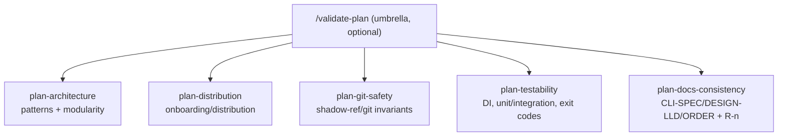
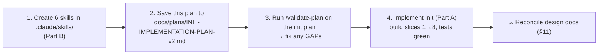

# `jejak init` — implementation plan (pattern-based, modular)

> Architecture: **hybrid distribution** (project devDependency preferred, global fallback) +
> **polyglot** repos. Config is **committed**; `dev_handle` resolved lazily; shadow-ref + handle
> bootstrap are **idempotent** (reused by hooks). This revision restructures the code into small,
> single-responsibility files using explicit design patterns so `cli.ts` and `runInit` never
> become god-files.

---

## 1. Design patterns used (and why)

| Pattern | Applied to | Why / pays off when |
|---|---|---|
| **Command (module-per-verb)** | `commands/*.command.ts` + registry | `cli.ts` becomes a thin loop; adding `setup`/`status`/… is one new file, not edits to a growing switchboard |
| **Adapter + Registry** | `agents/` (`AgentAdapter`, `ClaudeCodeAdapter`, `CursorAdapter`) | Cursor/Codex land as new adapter files; detection/picker code never changes |
| **Strategy** | `modes/` (`ProjectMode` vs `GlobalMode`) | project/global behave differently (devDep add vs not, hook invocation, guidance); isolate the divergence |
| **Chain of Responsibility** | `handle/` ordered `HandleSource[]` | dev_handle fallback chain (jejak.handle → user.name → email); add/reorder a source without touching the runner |
| **Pipeline / Pipes-and-Filters** | `init/steps/*` ordered `InitStep[]` | `runInit` is a tiny runner over composable, individually-testable steps |
| **Facade** | `git/GitClient.ts` over the `git` CLI | one seam for all plumbing; everything else speaks typed methods, not argv |
| **Repository** | `config/ConfigStore`, `shadow/ShadowRepository` | persistence isolated behind intent-named methods |
| **Dependency Injection** | `InitContext` carries `git`, `prompter`, `reporter` | unit tests inject fakes (no real git repo / no TTY); steps stay pure |

---

## 2. Layered module structure



---

## 3. Directory / file layout

```
src/
├── cli.ts                         # build program, iterate command registry (≈15 lines)
├── version.ts  · types.ts  · errors.ts   # errors.ts: InitError(exitCode), GitError
├── app/
│   └── AppDeps.ts                 # { git, prompter, reporter } container (DI root)
├── commands/
│   ├── index.ts                   # CommandModule[] registry
│   ├── CommandModule.ts           # interface { name; register(program, deps) }
│   ├── init.command.ts            # REAL → runInit
│   └── {setup,status,log,show,link,push,fetch,attach,doctor,uninstall,active-session-id}.command.ts  # thin stubs (still split out)
├── init/
│   ├── runInit.ts                 # pipeline runner over steps
│   ├── InitContext.ts             # shared mutable context + injected deps
│   └── steps/
│       ├── InitStep.ts            # interface { name; run(ctx) }
│       ├── GuardStep.ts           # git worktree + self-setup refusal
│       ├── ResolveModeStep.ts     # Strategy selection
│       ├── ResolveAgentStep.ts    # Adapter registry + picker
│       ├── WriteConfigStep.ts     # ConfigStore.write
│       ├── ProjectDepStep.ts      # project-mode devDep add (Strategy hook)
│       ├── EnsureShadowRefStep.ts # ShadowRepository.ensure
│       ├── WorkspaceFilesStep.ts  # .jejakignore
│       └── SummaryStep.ts         # reporter output + next steps
├── agents/
│   ├── AgentAdapter.ts            # interface
│   ├── registry.ts                # adapters + detectAll/findSupported/validate
│   ├── ClaudeCodeAdapter.ts       # supported
│   └── CursorAdapter.ts           # unsupported (detect-for-messaging)
├── modes/
│   ├── ModeStrategy.ts            # interface
│   ├── ProjectMode.ts  · GlobalMode.ts
│   └── detectMode.ts              # package.json presence + flags
├── handle/
│   ├── HandleResolver.ts          # runs sources in order (CoR)
│   ├── sources.ts                 # HandleSource[] (jejak.handle→user.name→email)
│   └── slugify.ts
├── config/
│   └── ConfigStore.ts             # committed .jejak/config.json (Repository)
├── workspace/
│   └── WorkspaceFiles.ts          # .jejakignore writer (service; WorkspaceFilesStep calls it)
├── prompt/
│   ├── Prompter.ts                # interface (confirm/select, isInteractive)
│   └── InquirerPrompter.ts        # @inquirer/prompts impl; SIGINT→exit 130
├── git/
│   └── GitClient.ts               # Facade over git CLI
└── shadow/
    ├── constants.ts               # SHADOW_REF, SHADOW_VERSION, seed files, .gitattributes
    └── ShadowRepository.ts        # ensure() (Phase A) + upsert() STUB (Phase B)
tests/
├── commands/init.command.test.ts
├── init/steps/*.test.ts           # each step with fake deps
├── agents/registry.test.ts
├── handle/{resolver,slugify}.test.ts
├── config/ConfigStore.test.ts
├── modes/detectMode.test.ts
└── integration/init.git.test.ts   # real temp git repo
```

---

## 4. Key interfaces (class diagram)



---

## 5. `cli.ts` after refactor (Command pattern)


`cli.ts` shrinks to building `AppDeps` + looping the registry. `PUBLIC_COMMAND_NAMES` is
derived from the registry (keeps `verb-coverage.test.ts` green).

---

## 6. init pipeline (Pipeline pattern) — runtime sequence

```mermaid
sequenceDiagram
  participant R as runInit
  participant C as InitContext
  participant S as steps[]
  R->>C: build context (cwd, flags, inject git/prompter/reporter)
  loop each InitStep (ordered)
    R->>S: step.run(ctx)
    Note over S,C: step reads/mutates ctx; throws InitError to abort
  end
  Note over R: GuardStep → ResolveModeStep → ResolveAgentStep →<br/>WriteConfigStep → ProjectDepStep → EnsureShadowRefStep →<br/>WorkspaceFilesStep → SummaryStep
  R->>C: reporter.flush() → summary + Next: jejak setup
```

Each step is independently unit-tested with a fake `GitClient`/`Prompter` — no real git or TTY.

---

## 7. dev_handle (Chain of Responsibility)



## 8. Shadow-ref bootstrap (Facade + Repository) — git plumbing


Seed tree (shadow ref only): `.gitattributes` (`sessions/** merge=ours` ·
`index/**/by-commit.ndjson merge=union` · `*.jsonl.gz binary`), `README.md`, `VERSION=1`.

---

## 9. Build order (suggested commit slices)

```mermaid
flowchart LR
  P1["1. git/GitClient + errors + shadow/constants"] --> P2["2. agents/ (adapters+registry)"]
  P2 --> P3["3. handle/ (resolver+sources+slugify)"]
  P3 --> P4["4. config/ConfigStore + modes/ + prompt/"]
  P4 --> P5["5. shadow/ShadowRepository.ensure"]
  P5 --> P6["6. init/steps/* + InitContext + runInit"]
  P6 --> P7["7. commands/ registry + cli.ts refactor"]
  P7 --> P8["8. tests (unit per module + integration)"]
```



Each slice compiles + is unit-tested before the next. `commands/` refactor (slice 7) also
moves the existing stub verbs into their own files — directly fixing the "cli.ts gets big"
concern across the whole CLI, not just init.

---

## 10. Testing (DI makes this clean)

- **Per-module units (no git, no TTY):** inject `FakeGitClient` + `FakePrompter`.
  - `slugify` / `HandleResolver` chain · `agents/registry` detect 0/1/many + cursor unsupported
  - `detectMode` project/global/flags · `ConfigStore` round-trip + re-init merge
  - each `InitStep` in isolation (Guard refusal, ResolveAgent picker paths, ProjectDep add, etc.)
- **Integration (real temp git repo, `mkdtemp`+`git init`):** `integration/init.git.test.ts`
  asserts project vs global config, `git show-ref` ref creation, seed-tree contents,
  `merge.ours.driver=true`, idempotent re-init (sha unchanged, exit 0), refusal exit 1,
  no-TTY exit 1, SIGINT exit 130.

---

## 11. Design docs to reconcile (encode old global-only model)
`INIT-IMPLEMENTATION-PLAN.md` (hybrid + mode; flip Q2; drop dev_handle from schema) ·
`DESIGN-LLD.md §2` (distribution + handle chain) · `CLI-SPEC.md` (`--project`/`--global`,
committed config, project-mode teammate flow) · `IMPLEMENTATION-ORDER.md` (setup wires
portable `npx jejak` vs embedded path; never clobber existing `.claude` hooks).

## 12. Deferred
`jejak setup` hook wiring + conflict UX (item 5) · `ShadowRepository.upsert`/fixtures
(item 3 / Phase B) · `jejak view` webserver (same distribution channel; lazy deps) ·
Cursor/Codex adapters (interfaces ready, impls later).

---

# Part B — Plan-validation skills (project guardrails)

Encode the principles above as **committed Claude Code skills** under `.claude/skills/` so
every future plan in this repo is validated against the same rubric (and the team shares them).

## B1. Skill mechanism
Each skill = `.claude/skills/<name>/SKILL.md` with frontmatter:
```
---
name: <skill-name>
description: <when to trigger — e.g. "Use when writing or reviewing an implementation plan for jejak to validate its <dimension>.">
---
<rubric: ordered criteria, each with PASS/GAP/N-A + required-evidence + fix template>
```
Body instructs Claude: read the target plan (arg path or the active plan), evaluate each
criterion, output a table `criterion → verdict → evidence → fix`, end with a GAP count.

## B2. Non-overlapping skill set (each owns a disjoint dimension)



| Skill | Disjoint criteria (no overlap across skills) |
|---|---|
| `plan-architecture` | Command-per-verb (no god cli.ts) · Adapter+Registry (agents) · Strategy (modes) · CoR (fallback chains) · Pipeline (orchestration) · Facade (git) · Repository (persistence) · DI seams · single-responsibility files · feature-grouped dirs |
| `plan-distribution` | hybrid project+global · polyglot (no Node-only assumption) · committed-vs-per-dev config split · no per-dev install/init anti-pattern · lazy idempotent bootstrap reused by hooks · dev_handle not committed |
| `plan-git-safety` | never checkout shadow ref · orphan commit (no -p) · CAS update-ref · merge.ours.driver registered · .gitattributes seed-tree-only · merge=union for index · idempotency matrix |
| `plan-testability` | DI fakes (no real git/TTY in units) · unit vs integration split · exit-code assertions · failure-path coverage |
| `plan-docs-consistency` | no contradiction w/ CLI-SPEC/DESIGN-LLD/IMPLEMENTATION-ORDER · lists doc updates on locked-decision change · honors resolved review findings (R-n) |

`validate-plan` (umbrella) only **sequences** the five and aggregates a scorecard — it holds
no criteria itself, so each rubric stays single-source.

## B3. Files to create (on approval)
```
.claude/skills/
├── validate-plan/SKILL.md          # umbrella (optional)
├── plan-architecture/SKILL.md
├── plan-distribution/SKILL.md
├── plan-git-safety/SKILL.md
├── plan-testability/SKILL.md
└── plan-docs-consistency/SKILL.md
```
Scope: **project** (`.claude/skills/`, committed) so they're team-shared and repo-relevant.
Invocation: manual (`/plan-architecture …`) or auto via `description` when a plan is in play.

**Decided:** 5 focused skills **+** `/validate-plan` umbrella; **project-scoped** `.claude/skills/`.

---

# Execution order (on approval)



Phases 1–3 are docs/skills only (no source code). I will **pause after phase 3** and report the
`/validate-plan` scorecard before touching `src/` — so the guardrails get applied to this plan
first, exactly as intended. No code until you approve continuing to phase 4.
