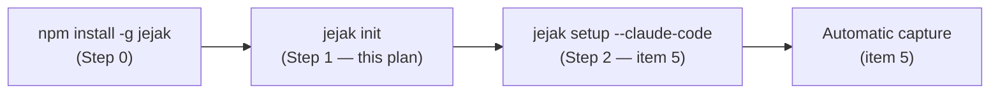
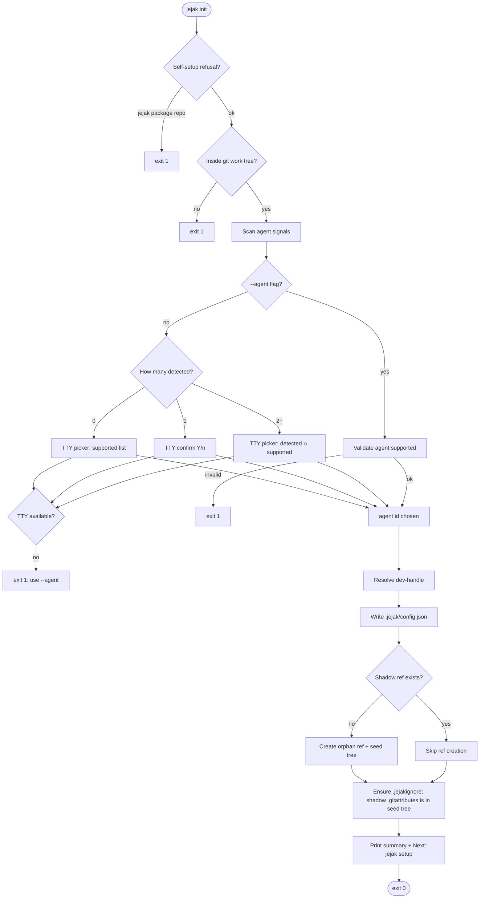
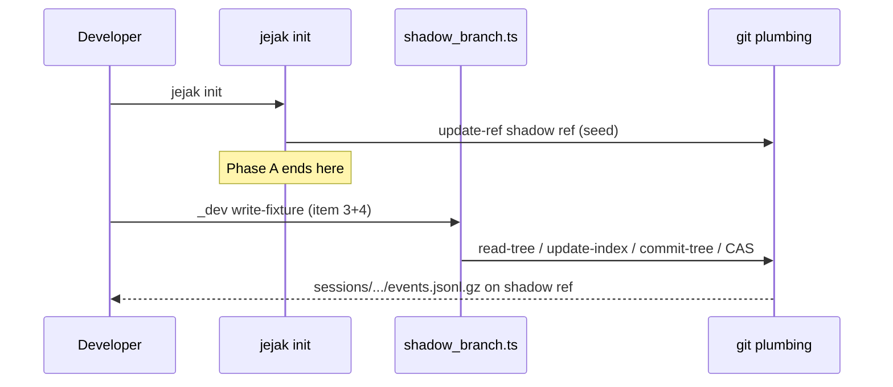

# `jejak init` — Implementation plan

> ⚠️ **SUPERSEDED by [INIT-IMPLEMENTATION-PLAN-v2.md](INIT-IMPLEMENTATION-PLAN-v2.md)** (the implemented design).
> v2 changed three decisions recorded here:
> 1. **Distribution is hybrid** (project devDependency + global fallback), not global-only — `init` records a `mode`.
> 2. **Config is committed** (`.jejak/config.json` = `{v, agent, mode}`), reversing this doc's Q2 "config is local".
> 3. **`dev_handle` is no longer in config** — it is resolved per-developer at runtime (so committed config is identical for all teammates).
>
> The git-plumbing design (orphan ref, CAS, seed-tree `.gitattributes`, `merge.ours.driver`) and the review log (R-1…R-12) below remain accurate and were carried into v2. Read this for that detail; read v2 for what was built.

**Status:** Superseded — see v2 (init shipped)  
**Tracks:** [CLI-SPEC.md § `jejak init`](../CLI-SPEC.md#jejak-init) · [IMPLEMENTATION-ORDER.md §4](../IMPLEMENTATION-ORDER.md#4-shadow-storage--init)  
**Design:** [DESIGN-LLD.md §2, §10, §11](../DESIGN-LLD.md)

This plan splits **init** into two phases so we can ship Step 1 onboarding before the strip pipeline (item 3) exists.

| Phase | Scope | Item gate |
|---|---|---|
| **A** | Agent detect + picker + repo config + shadow ref bootstrap | Can start after CLI-SPEC sign-off |
| **B** | `shadow_branch.ts` upsert, fixtures, round-trip tests | After item 3 (strip) |

---

## 1. Goals and non-goals

### Goals (Phase A — this plan’s primary deliverable)

1. Run **`jejak init`** in any normal git repo (not the jejak dev repo).
2. **Detect** which AI agent(s) the repo already uses; if **0 or 2+**, guide the developer through a **picker** (v0.1: only `claude-code` is selectable).
3. Persist choice in **`.jejak/config.json`** (local, under gitignored `.jejak/`).
4. Create **`refs/heads/jejak/sessions/v1`** with seed tree (§11) **without** checking out that branch.
5. Ensure working-tree **`.gitattributes`** and **`.jejakignore`** exist (idempotent).
6. Print clear **next step**: `jejak setup --claude-code` (item 5 — not part of Phase A).

### Non-goals (Phase A)

- Installing Claude/git hooks (`jejak setup` — item 5).
- Writing session blobs to the shadow ref (`shadow_branch.upsert` — Phase B).
- SQLite ledger (`session_ledger` — item 5).
- PII scanner initialization.
- Cursor/Codex adapters (detection may *see* `.cursor/` later; picker only offers `claude-code` in v0.1).

---

## 2. Readiness

| Prerequisite | State |
|---|---|
| Item 1 scaffold | Done |
| `init` UX in CLI-SPEC | Drafted — **needs your sign-off** |
| Test project `~/Documents/projects/jejak-testproj` | Exists, empty git repo |
| Item 3 strip | **Not required** for Phase A |
| Item 4 full checklist | **Requires** Phase B + item 3 for step 4 (`_dev write-fixture`) |

**Recommendation:** Implement **Phase A** first; mark item 4 partially done; complete item 4 when item 3 lands.

---

## 3. Position in the onboarding flow



**Verb confusion guardrail:** only Step 0 uses the word “install”. Step 2 is **`setup`** (configure hooks), not install.

---

## 4. End-to-end init workflow



---

## 5. Agent detection

### 5.1 Signal table (v0.1)

| Agent ID | `supported` | Signals (repo root, any match) |
|---|---|---|
| `claude-code` | yes | Path exists: `.claude/settings.json`, `.claude/settings.local.json`, **or** `.claude/` (directory) |
| `cursor` | no (v0.2) | `.cursor/` — detect for messaging only; not in picker until adapter ships |

> [R-12] A bare `.claude/` dir is a weak signal (may be stale or copied global config). Fine
> for v0.1 — the 1-detected case is a **confirm**, not a silent commit, so it's the safety net.

**Detection algorithm:**

```
detected := []
for each registry entry:
  if any(signal matches cwd): detected.push(agent_id)

supported := registry.filter(a => a.supported)
```

Order of scan is fixed (documented); order of picker display: `claude-code` first, then future agents alphabetically.

### 5.2 Picker UX (TTY)

Picker library: **`@inquirer/prompts`** (decided — see §11/Q5; +1 dependency, accepted for UX quality and forward-compat with a real multi-agent select). Must work in Cursor terminal and iTerm. Note: in v0.1 only `claude-code` is `supported`, so every branch below is effectively a confirm — but the select abstraction is kept for the 2nd agent.

| Case | Prompt (example) |
|---|---|
| **0 detected** | `No AI agent detected in this repo. Choose agent for jejak capture:` → single select: `Claude Code (claude-code)` |
| **1 detected** | `Detected Claude Code (.claude/). Use for jejak capture? [Y/n]` — default Y |
| **2+ detected** | `Multiple agents detected: Claude Code, Cursor (unsupported). Choose one for jejak:` → only **supported** options |

**Cancellation:** Ctrl+C → exit **130** (SIGINT convention) — decided ([R-10]). CLI-SPEC's `jejak init` exit-code line must be updated to add `130 user cancelled` (currently lists only `1`).

### 5.3 Non-interactive

```bash
jejak init --agent claude-code
```

- Skips all prompts.
- Fails if `claude-code` not in supported registry.
- Does **not** require signals to be present (explicit user intent).

---

## 6. Low-level design

### 6.1 Module layout (new / changed)

```
src/
├── cli.ts                    # wire init action → runInit()
├── init/
│   ├── run.ts                # orchestration (Phase A entry)
│   ├── agent_detect.ts       # scan + picker + --agent
│   ├── repo_guard.ts         # git repo + self-setup refusal
│   ├── config.ts             # read/write .jejak/config.json
│   ├── dev_handle.ts         # resolve + sanitize (DESIGN-LLD §2)
│   ├── shadow_bootstrap.ts   # orphan ref + seed tree (incl. shadow .gitattributes)
│   └── workspace_files.ts    # .jejakignore (+ root .gitignore hint)
├── shadow_constants.ts       # ref name, VERSION, seed-file list — shared A/B [R-11]
├── shadow_branch.ts          # Phase B: upsert, sessionPath, CAS (stub → impl)
└── types.ts                  # JejakConfig, AgentId, DetectedAgent
```

**Principle:** `init/` owns onboarding; `shadow_branch.ts` owns all mutation of session blobs after Phase B.

### 6.2 Git plumbing — shadow ref bootstrap

**Invariant:** Never `git checkout refs/heads/jejak/sessions/v1`. Working tree and `HEAD` stay on the developer’s branch.

**Ref name (locked):** `refs/heads/jejak/sessions/v1`

**Seed tree (first commit on shadow ref):**

| Path | Content |
|---|---|
| `.gitattributes` | Shadow-branch merge rules (see §6.3). This is the **only** copy — it lives on the shadow tree, never the working tree (see [R-1]). |
| `README.md` | Short pointer: “Jejak session traces — do not checkout this branch for normal work” |
| `VERSION` | `1` (schema / shadow layout version) |
| `sessions/` | Omit until first write — first upsert creates `sessions/<handle>/...` |
| `index/` | Omit until first index write |

**Creation sequence (plumbing):** reuses the same temp-index pattern as the Phase B
upsert path (DESIGN-LLD §10.1) so there is one tree-building code path, not two ([R-6]).

```text
1. git rev-parse --verify --quiet refs/heads/jejak/sessions/v1
   → if success: SKIP to step 6 (ref already exists)

2. For each seed file (README.md, VERSION, .gitattributes):
     blob=$(git hash-object -w --stdin)

3. Build the tree via a throwaway index (GIT_INDEX_FILE=$tmp):
     git update-index --add --cacheinfo <mode>,<blob>,<path>   # per seed file
     tree=$(git write-tree)

4. commit=$(git commit-tree $tree -m "jejak: initialize shadow sessions v1")
   # no -p → orphan root commit; working tree / HEAD untouched

5. git update-ref refs/heads/jejak/sessions/v1 $commit ""
   # CAS: empty old-value = "must not already exist"; fails atomically on a
   #   concurrent init that won the race (then re-verify and treat as exists) [R-5]

6. git config merge.ours.driver true   # register the 'ours' driver (else merge=ours
   #   is a silent no-op — see [R-2]); idempotent
7. (working tree) write .jejakignore if missing — see §6.4
```

**Implementation note:** wrap git calls in `src/git.ts` (`execFile('git', [...])`) with typed errors; cwd = repo root (`git rev-parse --show-toplevel`). Ref name + `VERSION` + the seed-file list live in one shared constants module reused by Phase B (`shadow_branch.ts`) so the future `v2` layout can’t drift between the two ([R-11]).

### 6.3 Shadow-tree `.gitattributes` (seed tree only)

This file is committed **into the shadow ref's seed tree** (step 2 above) — **not** the
developer's working tree. Working-tree `.gitattributes` on the dev's branch does not apply
to merges happening on the orphan shadow ref (REVIEW-LLD C-3), and writing shadow paths
there would wrongly match a real `sessions/`/`index/` dir in the user's own project ([R-1]).

```gitattributes
sessions/** merge=ours
index/**/by-commit.ndjson merge=union
*.jsonl.gz binary
```

- `merge=ours` — keep our copy of an immutable session blob on conflict. Requires the
  driver registered via `git config merge.ours.driver true` (§6.2 step 6); git has no
  built-in `ours` driver ([R-2]).
- `merge=union` — concatenate concurrent appends to the append-only index ndjson
  (DESIGN-LLD §12/§18). **Not** `ours` (which would drop concurrent index writes). `union`
  is a built-in driver, no registration needed.

Exact rules may be tuned in Phase B; init establishes the seed copy.

### 6.4 Working-tree `.jejakignore`

The only working-tree file init writes (besides the optional root-`.gitignore` hint).
Written only if missing (do not clobber user edits). Contains **trace-content exclusions
only** — local-state git-ignore concerns (`.jejak/disabled`, dispatch logs) belong in the
root `.gitignore` via the `.jejak/` entry, not here ([R-9]).

```gitignore
# Jejak trace exclusions — file content never captured into traces. Extend as needed.
.env
.env.*
*.pem
*.key
id_rsa*
```

**Note:** entire `.jejak/` is typically listed in the repo’s root `.gitignore` (README pattern). Init should **suggest** adding `.jejak/` to root `.gitignore` if absent (print hint, do not auto-edit without spec approval — **open question §12 Q1**).

### 6.5 `.jejak/config.json` schema (v1)

Format: **JSON** (zero-dep; machine-written/read, never hand-edited). `.jejak/pii.yaml`
stays YAML and is unrelated — it is a later, hand-editable override file (item 6).

```json
{
  "v": 1,
  "agent": "claude-code",
  "dev_handle": "aditya-jha",
  "initialized_at": "2026-05-30T12:00:00Z",
  "jejak_version": "0.1.0-dev",
  "detected": [".claude/"]
}
```

| Field | Source |
|---|---|
| `agent` | Picker or `--agent` |
| `dev_handle` | resolution chain below at init time |
| `initialized_at` | ISO UTC |
| `jejak_version` | `src/version.ts` |

**dev-handle resolution (amends DESIGN-LLD §2 — see note):**

```text
1. config.dev_handle in existing .jejak/config.json (re-init)
2. git config jejak.handle (repo)
3. git config jejak.handle (global)
4. git config user.name  → slugify   (e.g. "Aditya Jha" → "aditya-jha")
5. git config user.email → local-part before @  (fallback if user.name unset)
6. FAIL with: set user.name / user.email or jejak.handle
```

**Why prefer `user.name` over the email local-part (your question):** the handle is a
display + directory-partition key (`sessions/<handle>/…`), not a security identity, so a
human-readable `aditya-jha` is friendlier in `git log`, `jejak show`, and the tree than
`batu.aditya007`. The original DESIGN-LLD §2 chain used the email local-part purely for
**collision-resistance** — two teammates both named "Aditya Jha" would slugify to the same
`aditya-jha` and share a partition. For v0.1 dogfood (small team) that's acceptable, and
`git config jejak.handle <unique>` (steps 2–3) is the explicit escape hatch on collision.
**Action:** if you accept this, update DESIGN-LLD §2's dev-handle row to insert `user.name`
ahead of the email local-part so the two docs agree.

**Sanitize / slugify:** lowercase; collapse internal whitespace to a single `-`; replace
`[+/\\:@]` (and any remaining whitespace) with `-`; strip leading/trailing `-`; max 64
chars; reject empty after sanitize (→ fall through to next chain step).

### 6.6 Self-setup refusal

Read `package.json` at git root (if present). If its `name` equals the **running binary's
own package name** (resolve from the CLI's own `package.json`, not a hardcoded literal — so
a future rename can't bypass it), refuse:

```text
jejak: refusing to initialize in the jejak development repository.
Use a separate test project (see docs/CLI-SPEC.md).
```

Exit **1**. Same guard reused by `jejak setup` (item 5).

- **No / unparseable `package.json`** (Python, Go, empty repos): treat as "not jejak" →
  proceed. Must not throw ([R-7]).
- **Override:** hidden, undocumented `--i-know-what-im-doing` bypasses the guard, per
  DESIGN-LLD §9.1 — needed for jejak's own hand-crafted hook tests; never in `--help` ([R-7]).

### 6.7 Idempotency matrix

| Step | Already done | Behavior |
|---|---|---|
| Agent choice | config exists, no `--agent` | Keep existing `agent`; skip picker unless `--agent` overrides |
| Shadow ref | ref exists (`rev-parse --verify`) | Skip seed/`commit-tree`; seed-file re-verify optional |
| Shadow-tree `.gitattributes` | ref exists | N/A — lives only on seed tree, written once at ref creation |
| `merge.ours.driver` config | already `true` | `git config` is idempotent; re-set is a no-op |
| `.jejakignore` | file exists | Skip write |
| Re-run bare `jejak init` | all above | exit 0, print “already initialized” |

**`--agent` on re-init:** update `agent` in config; if changed, warn: `agent changed — run jejak setup --force`.

---

## 7. CLI integration

### 7.1 `src/cli.ts`

```typescript
program
  .command("init")
  .description("Add jejak to this repo; detect agent and record choice")
  .option("--agent <id>", "Agent adapter (non-interactive)")
  .action(async (opts) => {
    await runInit({ agent: opts.agent });
  });
```

- Async action (picker + git I/O).
- Top-level `runCli` already catches errors → stderr + exit 1.

### 7.2 Exit codes

| Code | Meaning |
|---|---|
| 0 | Success or already initialized |
| 1 | Not a repo; self-setup refusal; invalid `--agent`; no TTY; git plumbing failure; dev-handle resolution failure |
| 130 | User cancelled picker (SIGINT — decided, [R-10]) |

---

## 8. Example runs

### 8.1 Happy path — empty test project, interactive

```bash
$ cd ~/Documents/projects/jejak-testproj
$ jejak init

No AI agent detected in this repo.
Choose agent for jejak capture:
  1) Claude Code (claude-code)
Choice [1]: 1

jejak: initialized in /Users/you/Documents/projects/jejak-testproj
  agent: claude-code
  dev_handle: aditya-jha
  shadow: refs/heads/jejak/sessions/v1 (created)
  config: .jejak/config.json
  wrote: .jejakignore   (shadow .gitattributes lives on the shadow ref, not here)
Next: jejak setup --claude-code

$ echo $?
0

$ git show-ref refs/heads/jejak/sessions/v1
<sha> refs/heads/jejak/sessions/v1

$ git status
On branch main
nothing to commit, working tree clean   # except new .jejakignore (untracked)

$ cat .jejak/config.json
v: 1
agent: claude-code
dev_handle: aditya-jha
...
```

### 8.2 Repo already has `.claude/`

```bash
$ jejak init

Detected Claude Code (.claude/).
Use for jejak capture? [Y/n] y

jejak: initialized in ...
  agent: claude-code (from detection)
  ...
```

### 8.3 CI / non-interactive

```bash
$ jejak init --agent claude-code
jejak: initialized in ...
  agent: claude-code (from --agent)
  ...
```

### 8.4 Re-run (idempotent)

```bash
$ jejak init
jejak: already initialized
  agent: claude-code
  shadow: refs/heads/jejak/sessions/v1
Next: jejak setup --claude-code
```

### 8.5 Failure — jejak dev repo

```bash
$ cd ~/Documents/pluang/jejak
$ jejak init
jejak: refusing to initialize in the jejak development repository.
Use a separate test project (see docs/CLI-SPEC.md).
$ echo $?
1
```

### 8.6 Failure — no TTY, no flag

```bash
$ jejak init < /dev/null
jejak: non-interactive shell; pass --agent claude-code
$ echo $?
1
```

### 8.7 After init — setup still stub (today)

```bash
$ jejak setup --claude-code
Not yet implemented (item 5) — see docs/DESIGN-LLD.md §9
```

---

## 9. Phase B preview (item 4 completion)

Not implemented in Phase A; documented for cohesion.



| Function | Module | Responsibility |
|---|---|---|
| `sessionPath(handle, sessionId)` | `shadow_branch.ts` | `sessions/{handle}/{shard}/{sessionId}` |
| `upsertSessionBlobs(...)` | `shadow_branch.ts` | Finn lift §10.1 |
| `ensureShadowRef()` | split | Phase A: bootstrap; Phase B: no-op if exists |

**Item 4 test checklist step 4** depends on item 3 stripped JSONL + `_dev write-fixture`.

---

## 10. Testing strategy

### 10.1 Unit tests (vitest, no git repo)

| Test | Module |
|---|---|
| Sanitize handle edge cases | `dev_handle.ts` |
| Detect 0 / 1 / many signals | `agent_detect.ts` (tmpdir fixtures) |
| Config read/write round-trip | `config.ts` |
| Self-setup refusal paths | `repo_guard.ts` |

### 10.2 Integration tests (temp git repo)

| Test | Assert |
|---|---|
| `init` creates shadow ref | `git show-ref` |
| Shadow seed contains README, VERSION, `.gitattributes` | `git ls-tree refs/heads/jejak/sessions/v1` |
| Shadow `.gitattributes` has `merge=ours`/`union` + driver registered | `git cat-file`; `git config --get merge.ours.driver` == `true` |
| Working tree unchanged branch | `git branch --show-current` same; no `.gitattributes` written to work tree |
| Second `init` is idempotent (CAS) | ref sha unchanged; exit 0 "already initialized" |
| `init --agent` no TTY | exit 0 |
| `init` in non-Node repo (no `package.json`) | proceeds, exit 0 (no crash) [R-7] |
| handle from `user.name "Aditya Jha"` | `config.json` `dev_handle == "aditya-jha"` |

Use `vitest` + `mkdtemp` + `git init` in `beforeEach`.

### 10.3 Test project (manual / item 4 sign-off)

From IMPLEMENTATION-ORDER §4 steps 1–3 (Phase A covers 1–3; step 4 is Phase B).

---

## 11. Implementation checklist (Phase A)

| # | Task | Files |
|---|---|---|
| 1 | `git.ts` wrapper (rev-parse, hash-object, update-index/write-tree, commit-tree, update-ref CAS, config) | `src/git.ts` |
| 2 | `shadow_constants.ts` (ref name, VERSION, seed files) — shared A/B [R-11] | `src/shadow_constants.ts` |
| 3 | `repo_guard.ts` (incl. missing-`package.json` + `--i-know-what-im-doing`) | `src/init/repo_guard.ts` |
| 4 | `dev_handle.ts` (chain incl. `user.name` slugify) | `src/init/dev_handle.ts` |
| 5 | `agent_detect.ts` + registry | `src/init/agent_detect.ts` |
| 6 | TTY picker (`@inquirer/prompts`) | `src/init/prompt.ts` |
| 7 | `config.ts` (JSON read/write) | `src/init/config.ts` |
| 8 | `shadow_bootstrap.ts` (seed tree incl. shadow `.gitattributes` + `merge.ours.driver`) | `src/init/shadow_bootstrap.ts` |
| 9 | `workspace_files.ts` (.jejakignore + gitignore hint) | `src/init/workspace_files.ts` |
| 10 | `run.ts` orchestration | `src/init/run.ts` |
| 11 | Wire `cli.ts` | `src/cli.ts` |
| 12 | Unit + integration tests | `tests/init/*.test.ts` |
| 13 | Update CLI-SPEC (exit-code 130; status → `shipped` when verified) | docs |

**Dependency decisions (locked for v0.1):**

- **Picker:** `@inquirer/prompts` (+1 dep, accepted) — Q5.
- **Config:** JSON, **no** new dep (`node:fs` + `JSON`) — R-3.

---

## 12. Open questions (decide before coding)

| # | Question | Recommendation |
|---|---|---|
| Q1 | Auto-append `.jejak/` to root `.gitignore`? | **Hint only** on first init; don’t edit without user consent |
| Q2 | Commit config or keep local? | **Local** `.jejak/config.json` (under gitignored `.jejak/`) — matches per-dev disabled marker |
| Q3 | Store `detected` signals in config for doctor? | **Yes** — `detected: [".claude/"]` helps debugging (now in §6.5 schema) |
| Q4 | `sessions/` empty dir on seed tree? | **Omit** — first upsert creates path |
| Q5 | Inquirer vs readline? | **Inquirer** — decided (UX + multi-agent forward-compat) |
| Q6 | Config format YAML vs JSON? | **JSON** — decided (zero-dep); `.jejak/pii.yaml` stays YAML, separate file |
| Q7 | `user.name` vs email local-part for handle? | **`user.name` slugified first**, email fallback — see §6.5; amend DESIGN-LLD §2 |

---

## 13. References

- UX spec: [CLI-SPEC.md](../CLI-SPEC.md)
- Execution gate: [IMPLEMENTATION-ORDER.md §4](../IMPLEMENTATION-ORDER.md#4-shadow-storage--init)
- Shadow writes (later): [DESIGN-LLD.md §10.1](../DESIGN-LLD.md#101-tree-composition-c-1)
- Storage tree: [DESIGN-LLD.md §11](../DESIGN-LLD.md#11-storage-layout)

---

## 14. Review feedback (Claude, 2026-05-31)

Reviewed against CLI-SPEC.md, DESIGN-LLD.md §2/§9.1/§10/§11, REVIEW-LLD.md C-3,
current `src/cli.ts`, and `package.json`. Overall the plan is well-structured and
the Phase A/B split is the right call — it lets Step 1 onboarding ship before the
strip pipeline (item 3) exists. The orphan-ref-via-`commit-tree`-never-checked-out
approach, the idempotency matrix, and wrapping git in `src/git.ts` are all sound.
Below are the issues to resolve before coding, ordered by severity. Search markers:
each is tagged `[R-n]` — reply inline or strike through as you decide.

### Blocking — correctness

**[R-1] §6.3 working-tree `.gitattributes` is wrong, and contradicts a *resolved*
review finding.** REVIEW-LLD.md **C-3** already established: `.gitattributes` on the
developer's branch does **not** apply to merges happening on `refs/heads/jejak/sessions/v1`
(different branch context), and the shadow ref is an orphan with no working tree. So
appending shadow merge rules to the *working-tree* `.gitattributes`:
  - does **nothing** for shadow-ref merges (the whole point), and
  - can actively harm the user — `sessions/** merge=ours` / `index/** merge=ours`
    will match a real `sessions/` or `index/` directory in *their* project on *their*
    branch, silently changing how their own files merge.

  Resolution: **delete §6.3 entirely.** The shadow merge attributes belong only in the
  **seed tree's** `.gitattributes` (§6.2 already includes one — that is the correct and
  only home, exactly as C-3 prescribes). The developer's working tree needs *nothing*
  from jejak except `.jejakignore` (and the optional root-`.gitignore` hint, Q1). This
  also lets you drop the "duplicate of concept also appended to working tree" line in §6.2.

**[R-2] `merge=ours` is inert without registering the driver, and the index driver is
the wrong one.** Two sub-issues in the attributes block (§6.3, to be relocated to the
seed tree per R-1):
  - Git has **no built-in `ours` merge driver** (only the `-s ours` *strategy*). The
    attribute `merge=ours` is a no-op unless the repo has `git config merge.ours.driver true`.
    Init must set this, or the invariant is the same "paper invariant" C-3 warned about.
    (`merge=union` *is* built-in — no registration needed.)
  - The plan sets `index/** merge=ours`, but the design (DESIGN-LLD §12/§18, REVIEW-LLD C-3)
    specifies the index ndjson is **append-only** and wants **`merge=union`** (concatenate
    concurrent appends). `merge=ours` would *drop* concurrent index writes. Use
    `index/**/by-commit.ndjson merge=union`.
  - The line `refs/heads/jejak/sessions/v1 merge=ours` is meaningless — `.gitattributes`
    patterns match **pathnames inside a tree**, never ref names. Remove it.

  Suggested seed-tree `.gitattributes`:
  ```gitattributes
  sessions/** merge=ours
  index/**/by-commit.ndjson merge=union
  *.jsonl.gz binary
  ```
  plus, during init: `git config merge.ours.driver true`.

### Blocking — concrete gaps that stop you writing code

**[R-3] No parser for the chosen config format.** The plan writes `.jejak/config.json`
(§6.5) but `package.json` deps are only `commander` / `pino` / `better-sqlite3` — there
is no YAML library, and §12 never raises this. Decide now:
  - **JSON** (`.jejak/config.json`) — zero dep; config is machine-written/read, never
    hand-edited, so YAML's ergonomics buy nothing here. **Recommended.**
  - **YAML** — then add `js-yaml` (+`@types/js-yaml`). Note `.jejak/pii.yaml` is already
    YAML elsewhere in the design, so if you want one format across all `.jejak/*` files
    you'll add `js-yaml` anyway. If so, decide it here and reuse it. Either way it's a
    deliberate dependency call the plan currently skips.

**[R-4] The picker dependency is over-specified for v0.1.** With only `claude-code`
`supported`, all three detection branches collapse to the same thing — there is never
more than one selectable option:
  - 0 detected → "Configure for Claude Code? [Y/n]"
  - 1 detected → "Detected Claude Code. Use for jejak? [Y/n]"
  - 2+ detected → still only `claude-code` is offered → same confirm.

  So v0.1 has **no multi-choice picker at all**, just a Y/n confirm. `@inquirer/prompts`
  (§11/Q5 recommendation) is unjustified now — use zero-dep `readline` for the confirm,
  and revisit a real select-list when a 2nd `supported` agent lands. Keep the
  registry/detection abstraction (it's good); just don't build the select UI yet. The
  `PICK0`/`PICKN` branches in the §4 flowchart are premature — fold them into one confirm
  node for v0.1.

### Robustness

**[R-5] Ref-creation has a TOCTOU.** §6.2 steps 1 (`rev-parse --verify`) → 5
(`update-ref`) aren't atomic; two concurrent inits could both pass step 1 and both write.
Use compare-and-swap: `git update-ref refs/heads/jejak/sessions/v1 <commit> ""` — the
empty old-value means "must not already exist" and fails atomically otherwise. Cheap, and
matches the CAS discipline the write path uses elsewhere.

**[R-6] Reuse the upsert tree mechanism for the seed.** §6.2 uses `git mktree`. It works
for a flat tree, but the Phase B upsert path (DESIGN-LLD §10.1 / `shadow_branch.ts`)
already uses the `GIT_INDEX_FILE` temp-index + `update-index --add` + `write-tree`
pattern. Using that same pattern for the seed avoids a second tree-building code path and
extends naturally to nested paths later. Recommend dropping `mktree` in favor of it.

**[R-7] `package.json` may be absent; carry the override flag.** §6.6 reads `package.json`
at the repo root, but non-Node repos (Python, Go, …) have none. Treat absent/unparseable
`package.json` as "not jejak → proceed", not a crash. Also: DESIGN-LLD §9.1 defines a
hidden `--i-know-what-im-doing` override for the self-setup refusal; the plan omits it.
Include it (hidden, undocumented) so jejak's own dev repo isn't permanently un-init-able
for hand-crafted tests.

### Consistency / smaller

**[R-8] The `dev_handle` examples aren't reproducible from the resolution chain.** §6.5
step 4 takes the email local-part. The configured git email here is
`batu.aditya007@gmail.com` → handle `batu.aditya007`, but §6.5/§8.1 show `aditya-jha`.
That output only happens if `git config jejak.handle aditya-jha` is set (chain steps 2–3).
Either change the examples to `batu.aditya007`, or state the `jejak.handle` precondition,
so the happy-path output in §8.1 is actually what a fresh run prints.

**[R-9] `.jejakignore` conflates two jobs (§6.4).** It lists `.jejak/disabled` and
`.jejak/dispatch.log.jsonl` (which are *git-ignore* concerns — handled by putting `.jejak/`
in the root `.gitignore`, Q1) alongside `.env`/`*.pem` (which are *trace-content*
exclusions). `.jejakignore` should be **only** trace-capture exclusions. Drop the
`.jejak/*` lines.

**[R-10] Decide the cancel exit code once.** §5.2 and §7.2 say "130 or 1, pick one";
CLI-SPEC.md `jejak init` exit-codes line currently lists only `1` for "user cancelled".
Pick one (recommend **130**, SIGINT convention) and make CLI-SPEC and this plan agree
before coding, since tests will assert on it.

**[R-11] Single source of truth for ref name + seed layout.** Both
`src/init/shadow_bootstrap.ts` (Phase A) and `src/shadow_branch.ts` (Phase B) need
`refs/heads/jejak/sessions/v1`, the seed file set, and `sessionPath()`. Put the ref name,
`VERSION` value, and seed-file list in one shared constants module so the eventual `v2`
layout doesn't drift between the two.

**[R-12] `.claude/` directory alone is a weak signal.** A bare `.claude/` may be stale or
copied global config. Fine for v0.1 (the 1-detected confirm is the safety net), but worth
noting; also consider `.claude/settings.local.json` as an additional signal.

### Net

R-1 and R-2 are the real ones — they're a correctness bug the design review already
caught in another guise, so worth fixing before any code. R-3 and R-4 are decisions that
change what you `npm install` and how `prompt.ts` is written, so settle them first too.
The rest are polish that will otherwise surface as confusing test failures or
non-reproducible example output. Everything else in the plan I'd build as written.

### Resolution log (applied to the plan body, 2026-05-31)

| Ref | Status | What changed |
|---|---|---|
| R-1 | ✅ applied | §6.3 rewritten: shadow `.gitattributes` lives only in seed tree; no working-tree copy. §4 flowchart, §6.2 table, §6.7, §8.1 output, §10.2 updated. |
| R-2 | ✅ applied | Seed `.gitattributes` → `sessions/** merge=ours` + `index/**/by-commit.ndjson merge=union`; ref-name line dropped; `git config merge.ours.driver true` added (§6.2 step 6). |
| R-3 | ✅ decided | Config → **JSON** `.jejak/config.json` (zero-dep). Schema §6.5 + all refs updated. Q6 added. |
| R-4 | ⚖️ overridden | You chose to **keep `@inquirer/prompts`** for UX + multi-agent forward-compat. §5.2/§11/Q5 reflect this; the v0.1 "all branches collapse to a confirm" caveat is noted but not acted on. |
| R-5 | ✅ applied | Ref creation uses CAS `update-ref … ""` (§6.2 step 5). |
| R-6 | ✅ applied | Seed tree built via temp-index `update-index`/`write-tree`, not `mktree` (§6.2 step 3). |
| R-7 | ✅ applied | §6.6: missing/unparseable `package.json` → proceed; hidden `--i-know-what-im-doing` override added. Test added (§10.2). |
| R-8 | ✅ superseded | Resolved by the handle change below — examples now show `aditya-jha` and are reproducible. |
| R-9 | ✅ applied | §6.4 `.jejakignore` = trace-content exclusions only; `.jejak/*` lines removed (those go in root `.gitignore`). |
| R-10 | ✅ decided | Cancel = **130**. §5.2/§7.2 updated; CLI-SPEC exit-code line still needs the `130` row (task 13). |
| R-11 | ✅ applied | `src/shadow_constants.ts` added to module layout + checklist (ref name / VERSION / seed files shared A↔B). |
| R-12 | ✅ applied | `.claude/settings.local.json` added as a signal; weak-signal caveat noted (§5.1). |

**dev-handle change (your request, 2026-05-31):** resolution chain now prefers
`git config user.name` slugified (`"Aditya Jha"` → `aditya-jha`) ahead of the email
local-part (§6.5, Q7). Rationale and the collision caveat are in §6.5. **This amends the
locked DESIGN-LLD §2 dev-handle row — update that doc too so the two agree.**

### Still needs your action (doc edits outside this plan)

1. ~~**DESIGN-LLD §2**~~ — ✅ dev-handle row updated (user.name → email fallback).
2. ~~**CLI-SPEC.md `jejak init`**~~ — ✅ aligned with this plan (`config.json`, shadow-only `.gitattributes`, exit 130, signals).
3. **Sign off Q1** (gitignore hint-only vs auto-append) — then Phase A is ready to implement.
