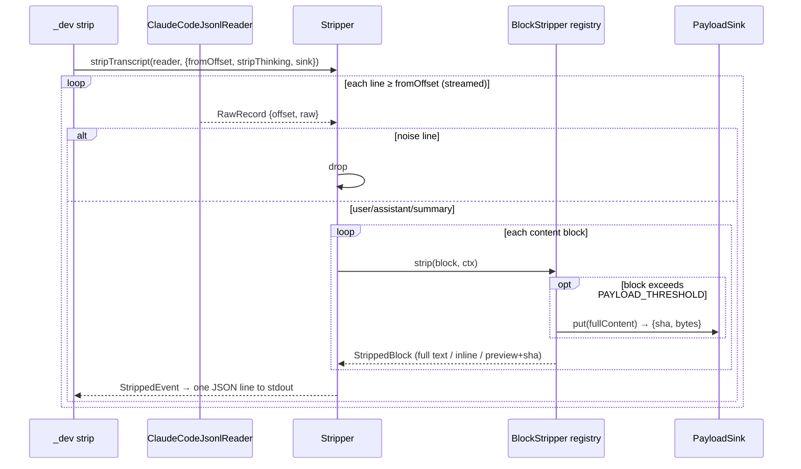
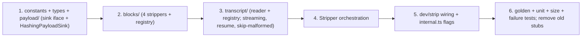

# Item 3 — Ingest & strip pipeline (implementation plan)

> Pattern-based, modular, mirroring the init build. Strip is **internal** (no user verb) — it
> feeds the capture worker (item 5) and unblocks init **Phase B** (`ShadowRepository.upsert`).

## Context

Raw Claude Code transcripts are large (a 40-line session ≈ 244 KB; real sessions reach
**5–20 MB**), and the bulk is tool output. Item 3 turns a raw `.jsonl` transcript into a
**readable narrative** (`events.jsonl`, ~95% smaller) plus **content-addressed payload blobs** for
the heavy parts — with a stable, golden-tested format, *before* any git I/O exists.

- **Tracks:** [IMPLEMENTATION-ORDER §3](../IMPLEMENTATION-ORDER.md) · **Design:** [DESIGN-LLD §7 (reader), §8 (stripper)](../DESIGN-LLD.md) · [ARCHITECTURE](../ARCHITECTURE.md)
- **Verbs touched:** none public — exercised via the hidden `jejak _dev strip` (already a stub).
- **Unblocks:** init Phase B round-trip (`_dev write-fixture` consumes stripped output) and the item-5 capture worker.

### Design principle (decided — drives every rule below)
**Capture irrecoverable, high-signal data with full fidelity; only offload recoverable or bulky
data — never destroy it.** Summarization is a *read-time, derived* feature, never lossy at capture.

### Input contract (observed from real transcripts)
- JSONL, one object/line. Top-level: `type`, `uuid`, `parentUuid`, `timestamp`, `sessionId`,
  `cwd`, `gitBranch`, `version`, `message`, `toolUseResult`.
- Line `type`s: `user`, `assistant`, `summary`/`system`, + noise (`agent-setting`,
  `queue-operation`, `attachment`, `last-prompt`).
- `message.content[]` block `type`s: `text`, `thinking`, `tool_use`, `tool_result`.

### What stripping does (decided)
1. **Drop noise lines** (`agent-setting`, `queue-operation`, `attachment`, `last-prompt`).
2. **`thinking` → full verbatim, NO cap.** It is the load-bearing "why" and is irrecoverable —
   the highest-value content and *not* the size driver. `--strip-thinking` redacts it entirely
   (privacy opt-out only). **Amends DESIGN-LLD §8's 4 KB cap.**
3. **`text` → passthrough.**
4. **`tool_use` → keep `name` + `input` inline** (small, high-signal: the "what it decided to
   do"). Only a payload-sized input (e.g. a `Write` file body) is offloaded like a result.
5. **`tool_result` → the size driver.** Keep a **head+tail preview** + `bytes` + `sha`; the full
   content goes to a **content-addressed payload blob** via a `PayloadSink`. The sha is now
   load-bearing: **expand-on-demand** (`jejak show --expand`), **free dedup** (git is
   content-addressed), and **change-detection** (same sha across turns = unchanged output).
6. Per event keep only structural fields: `id` (uuid), `parentId`, `type`, `timestamp`, `role`,
   `content[]`. Session context (`cwd`, `gitBranch`, `version`, `sessionId`) → `meta.json` at
   shadow-write (item 4), not per event.

> The `PayloadSink` seam is why this stays clean: **strip is storage-agnostic.** For `_dev strip`
> the sink hashes (and optionally dumps to a dir); item 4's shadow-write injects a git-blob sink
> so the sha becomes a real CAS pointer. Out of scope here: PII (item 6), gzip (item 4),
> pre-turn diff (v0.2).

---

## 1. Design patterns

| Pattern | Applied to | Why |
|---|---|---|
| **Adapter + Registry** | `transcript/` — `TranscriptReader` iface + `ClaudeCodeJsonlReader` + registry | Cursor/Codex readers drop in later; stripper unchanged |
| **Strategy + Registry** | `blocks/` — `BlockStripper` per content-block type via a map | Each block rule is one small file; add a type = new file |
| **Strategy + DI (Facade)** | `payload/` — `PayloadSink` iface; `HashingPayloadSink` now, `GitBlobPayloadSink` in item 4 | Strip is storage-agnostic; the same code hashes for dev and writes git blobs in the pipeline |
| **Pipeline (streaming)** | `Stripper` consumes the reader's async iterable → emits events + payloads | Constant memory on 20 MB inputs |
| **Single source of truth** | `strip/constants.ts` (preview sizes, payload threshold, size target) | No scattered magic numbers |

---

## 2. Module layout

```
src/strip/
├── constants.ts                 # PREVIEW_HEAD/TAIL, PAYLOAD_THRESHOLD, SIZE_TARGET (no thinking cap)
├── types.ts                     # RawRecord, StrippedEvent, StrippedBlock, Payload
├── payload/
│   ├── PayloadSink.ts           # interface: put(content) → {sha, bytes}
│   └── HashingPayloadSink.ts    # sha256 + byte count; optional --payloads-dir dump (GitBlobPayloadSink = item 4)
├── transcript/
│   ├── TranscriptReader.ts      # interface: read(path, {fromOffset?}) → AsyncIterable<RawRecord>
│   ├── registry.ts              # format registry (claude-code) + lookup
│   └── ClaudeCodeJsonlReader.ts # streaming line reader, JSON.parse, byte offsets, resume, skip-malformed
├── blocks/
│   ├── BlockStripper.ts         # interface { type; strip(block, ctx): StrippedBlock | null }
│   ├── registry.ts              # blockType → BlockStripper
│   ├── TextBlockStripper.ts     # passthrough
│   ├── ThinkingBlockStripper.ts # FULL verbatim; redact iff ctx.stripThinking
│   ├── ToolUseBlockStripper.ts  # name + input inline; payload-sized input → sink
│   └── ToolResultBlockStripper.ts # head+tail preview + bytes + sha; full → sink
└── Stripper.ts                  # orchestration: RawRecord → StrippedEvent | null; routes payloads to the sink
src/dev/strip.ts                 # wire `_dev strip <path> [--resume-from] [--strip-thinking] [--payloads-dir]`
tests/strip/                     # unit per module + golden + size tests
tests/fixtures/golden/           # synthetic raw.jsonl → expected events + payload manifest (NO real PII)
```

Supersedes the flat scaffold stubs `src/stripper.ts` and `src/transcript_readers/*` (removed).

---

## 3. Data shapes & seams (class diagram)

```mermaid
classDiagram
  class StrippedEvent {
    +string id
    +string? parentId
    +string type
    +string? timestamp
    +string? role
    +StrippedBlock[] content
  }
  class StrippedBlock {
    +string type        "text|thinking|tool_use|tool_result"
    +string? text       "text / full thinking / redaction marker"
    +string? name       "tool_use name"
    +unknown? input     "tool_use small input (inline)"
    +string? preview    "head+tail of an offloaded payload"
    +string? sha        "content address of the full payload"
    +number? bytes
  }
  class TranscriptReader {
    <<interface>>
    +read(path, opts) AsyncIterable~RawRecord~
  }
  class BlockStripper {
    <<interface>>
    +string type
    +strip(block, ctx) StrippedBlock?
  }
  class PayloadSink {
    <<interface>>
    +put(content) Payload  "{sha, bytes}"
  }
  ClaudeCodeJsonlReader ..|> TranscriptReader
  ThinkingBlockStripper ..|> BlockStripper
  ToolResultBlockStripper ..|> BlockStripper
  HashingPayloadSink ..|> PayloadSink
  Stripper --> TranscriptReader
  Stripper --> BlockStripper
  Stripper --> PayloadSink
```

`StripContext` (injected into block strippers): `{ stripThinking: boolean, sink: PayloadSink }`.

---

## 4. Pipeline (streaming sequence)



Resume: `--resume-from <byteOffset>` → `fs.createReadStream({ start })`, begins at the next line
boundary; events before are never re-emitted (LESSONS-FROM-FINN §4 offset discipline — "still
advance the offset"). A malformed JSON line mid-file is **skipped (counted), never aborts** — a
transcript may be mid-write. Each event is independently emittable → valid JSONL whether resumed or not.

---

## 5. Rules (locked tables)

**Line-type mapping:**

| Raw `type` | Action |
|---|---|
| `user`, `assistant` | strip `message.content[]` → `StrippedEvent` |
| `summary`, `system` | keep (text) |
| `agent-setting`, `queue-operation`, `attachment`, `last-prompt` | **drop** |

**Block rules:**

| Block | Rule |
|---|---|
| `text` | passthrough |
| `thinking` | **full verbatim**, no cap; `ctx.stripThinking` → `[thinking redacted]` |
| `tool_use` | keep `name`; `input` inline if `≤ PAYLOAD_THRESHOLD`, else preview+sha via sink |
| `tool_result` | inline if `≤ PAYLOAD_THRESHOLD`, else **head+tail preview + bytes + sha** via sink |

**Size guarantee = reduction, not a cap.** Because bulk tool output is offloaded, the gzipped
narrative tracks conversation length, not tool volume (real sessions ≈ 3–5% of raw). Asserted as
gz ≤ ~10% of raw on a tool-heavy fixture; thinking is kept full, so a long reasoning-rich session
legitimately exceeds the ~500 KB-gz guideline (fidelity-first). *(Revised from a hard <500 KB cap.)*

---

## 6. `_dev strip` wiring
`src/dev/strip.ts` exports `devStrip({ path, resumeFrom, stripThinking, payloadsDir })`: pick the
reader from the format registry, build a `HashingPayloadSink` (writes `payloadsDir/<sha>` if given,
else hashes only), stream `Stripper` events as JSONL to stdout; exit 0, or **non-zero with a clear
message on a missing/unreadable path**. `commands/internal.ts` already registers `_dev strip <path>
--resume-from`; add `--strip-thinking` and `--payloads-dir`, point the action at `devStrip`.
Internal/hidden — no `docs/user/` page (docs-coverage guards only public verbs).

---

## 7. Testing

- **Unit (no fs):** `ThinkingBlockStripper` (full passthrough at large sizes; redact mode);
  `ToolResultBlockStripper` (inline ≤ threshold; preview+sha above, sha computed over full content,
  head+tail correct); `ToolUseBlockStripper` (name+small input inline; large input offloaded);
  `HashingPayloadSink` determinism (same bytes → same sha); `Stripper` line drop/keep with a fake
  reader + fake sink (assert payloads routed to sink, events carry sha).
- **Reader (real fs, tmp):** parses JSONL; `fromOffset` skips earlier lines, emits no pre-offset
  id; **skips a malformed line mid-file and continues** (surfaces a count); tolerates a trailing
  partial line.
- **Failure path:** missing/unreadable input → `_dev strip` exits non-zero (asserted).
- **Golden:** `tests/fixtures/golden/basic.raw.jsonl` (synthetic; all 4 block types + noise +
  long thinking + oversized tool_result) → assert events deep-equal `basic.events.jsonl` and the
  payload set (sha→bytes) matches `basic.payloads.json`. **Hand-authored synthetic data — never a
  real transcript** (PII).
- **Size (reduction ratio):** a generated ~6 MB-of-tool_result fixture → gzipped narrative
  ≤ 10% of raw, while full thinking (40 KB) is preserved verbatim.
- `pnpm test` / `lint` / `typecheck` / `docs:gen` (no drift) green.

---

## 8. Build order



---

## 9. Doc reconciliation (item 3)
- **DESIGN-LLD §8** — rewrite: thinking is **full verbatim** (remove the 4 KB cap); tool_result/
  large tool_use offloaded to **content-addressed payload blobs** (preview+sha+bytes); list the
  drop set. Note the read-time `--expand` use.
- **DESIGN-LLD §11 (storage layout)** — add the content-addressed payload store the
  `GitBlobPayloadSink` will write at shadow-write (item 4); `events.jsonl.gz` holds only the
  narrative (+ sha refs). (Path shape decided in item 4 — recommend a shared `payloads/<sha>` for
  tree-level dedup.)
- **DESIGN-LLD §4 (Module layout)** — `src/stripper.ts` / `src/transcript_readers/*` → `src/strip/*`.
- **IMPLEMENTATION-ORDER §3** — tick Done-when; record results after test-project verification.
- No `CLI-SPEC` / `docs/user` change — strip is internal (`_dev`).

## 10. Cross-item impact (from the payload-blob decision)
- **Item 4 (shadow write):** add `GitBlobPayloadSink` (writes each payload via `GitClient.hashObject`,
  dedup'd by git) and store blobs under the shadow tree; `events.jsonl.gz` references them by sha.
- **Item 6 (read path):** `jejak show --expand` resolves sha → blob to show full output on demand;
  change-detection (compare shas across turns) is a free byproduct.

## 11. Deferred (not item 3)
PII redaction (item 6) · gzip (item 4) · `GitBlobPayloadSink` + `--expand` (items 4/6) ·
pre-turn diff (v0.2) · Cursor/Codex readers (interface ready).
