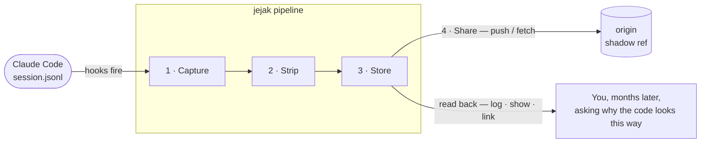
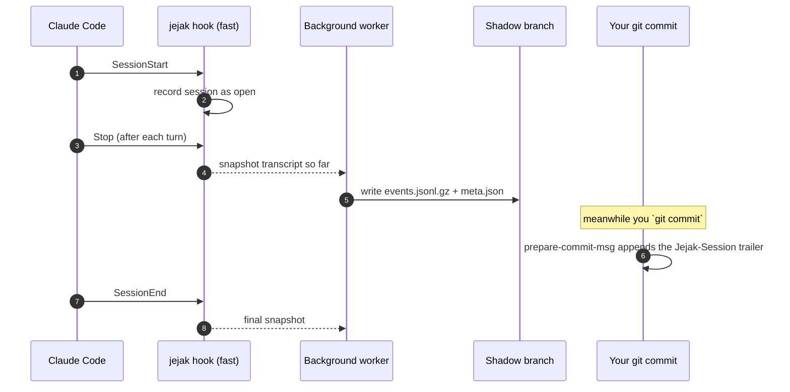
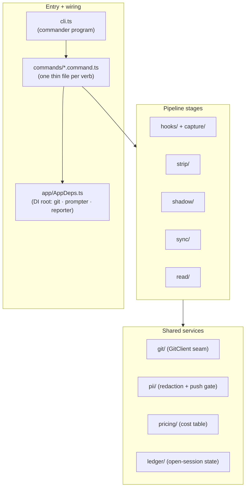

# How jejak is built

A five-minute orientation for anyone reading the code for the first time. The diagrams below are the
whole mental model — everything else is detail.

## The pipeline

Everything jejak does is one left-to-right pipeline. A Claude Code session log goes in; a compact,
shareable trace on a hidden git branch comes out.

| Stage | Question it answers | Read more |
|---|---|---|
| **Capture** | How do we get the session log off the laptop without slowing the agent? | [How capture works](./concepts/capture.md) |
| **Strip** | What's worth keeping, and what's recoverable noise? | [Capture → what gets stored](./concepts/capture.md#what-gets-stored-and-where) |
| **Store** | Where do traces live so they travel with the repo but never pollute it? | [The shadow branch](./concepts/shadow-branch.md) |
| **Share** | How do ten engineers pool traces without merge conflicts? | [Sharing traces](./concepts/sharing.md) |
| **Read** | How do you get the story back out? | [`jejak log`](./log.md) · [`show`](./show.md) · [`link`](./link.md) |

## The lifecycle

What actually fires, from a session opening to a trace landing on the shadow branch while your commit
gets anchored to it. The hooks are **fast and fail-open** — the heavy work runs in a detached worker,
so capture never blocks the agent or your commit.

The agent hooks (left) and the git hook (right) run independently — that's why a trace and the commit
it produced get linked without either one waiting on the other.

## The code map

How the folders under `src/` group by role. If you're about to change something, this tells you where
to look. **Start at `cli.ts`** and follow the arrows.

The key pattern: **commands are thin**. A `*.command.ts` file only parses flags and calls a `run*()`
function in its feature module — so the logic is testable without `commander` or a TTY, and adding a
verb means writing one command file plus the feature behind it.

## Going deeper

This page is the orientation. For the full design — hook tiers, the lossless strip, commit anchoring,
the conflict-free merge layers, and the privacy model — read the engineering docs in the repo:

- [`docs/ARCHITECTURE.md`](../ARCHITECTURE.md) — the complete architecture, with more diagrams
- [`docs/DESIGN-LLD.md`](../DESIGN-LLD.md) — the implementation-ready low-level design
