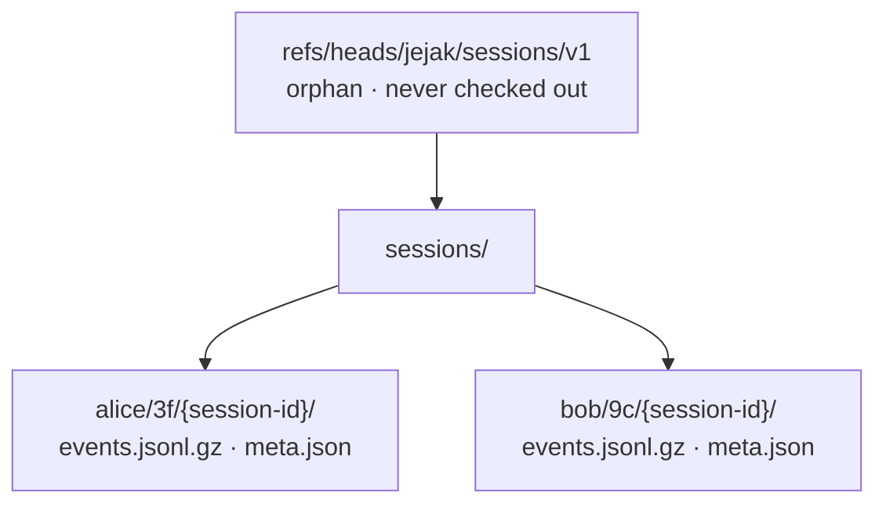

# The shadow branch

## What it is

The **shadow branch** is where jejak stores every captured trace. It lives at the git ref
`refs/heads/jejak/sessions/v1` — a branch that exists in your repository but is kept entirely
separate from the branches you work on (`main`, your feature branches, …).

It is an **orphan** branch: it has no shared history with your code branches and is never checked
out. You won't see it in your working tree, your file list, or your normal `git log`.

## Why it exists

jejak needs somewhere durable to keep session traces that:

- **travels with the repo** — clone the repo, get the traces (once pushed), no external service;
- **never touches your work** — capturing a session must not stage files, make commits on your
  branch, or change your working tree;
- **survives rebases and history edits** — because it's a separate ref, rewriting `main` doesn't
  disturb captured traces.

A separate orphan ref is the lightest way to get all three. Storing traces as ordinary commits on
your branch would pollute history; storing them outside git would lose the "clone and you have it"
property.

Inside the ref, every developer owns a separate subtree — which is what lets a whole team push to
the same branch without merge conflicts:



## How to use it

You rarely touch it directly — `jejak` commands manage it for you:

- [`jejak init`](../init.md) **creates** it (empty, with a seed `.gitattributes`).
- Capture (a later release) **writes** sessions into it automatically.
- `jejak push` / `jejak fetch` **sync** it with your remote.
- `jejak show` / `jejak log` **read** from it.

When you do want to look under the hood, use git plumbing (these read it without checking it out):

```console
$ git show-ref refs/heads/jejak/sessions/v1
$ git cat-file -p refs/heads/jejak/sessions/v1:.gitattributes
```

`jejak init` is idempotent — if the shadow branch already exists, re-running leaves it untouched.

## Kept off accidental pushes

Because the shadow branch lives under `refs/heads/`, git treats it like any other branch — which
means a sweeping push (`git push --all`, `git push --mirror`, or the legacy `push.default=matching`)
would otherwise carry it to a remote, slipping past the [privacy gate](sharing.md#the-privacy-gate)
that [`jejak push`](../push.md) enforces.

To prevent that, [`jejak setup`](../setup.md) installs a `pre-push` git hook that **refuses any push
which would publish the shadow branch**, unless that push came from `jejak push` itself. The hook is
plain bash with no dependency on jejak, so it keeps working even if the CLI is missing, and a normal
code push (one that doesn't touch the shadow branch) passes straight through.

`jejak push` carries a one-shot handshake (the `JEJAK_INTERNAL_PUSH` environment variable) that the
hook recognizes, so the gated path works while accidental pushes don't. If you ever need to publish
the branch by hand on purpose, set the same variable yourself:

```console
$ JEJAK_INTERNAL_PUSH=1 git push origin refs/heads/jejak/sessions/v1
```

`jejak doctor` reports whether the guard is installed, and warns if `push.default=matching`.

## Further reading

- [Git references (the `refs/` namespace)](https://git-scm.com/book/en/v2/Git-Internals-Git-References)
- [Orphan branches — `git switch --orphan`](https://git-scm.com/docs/git-switch#Documentation/git-switch.txt---orphan)
- [Git internal objects (blobs, trees, commits)](https://git-scm.com/book/en/v2/Git-Internals-Git-Objects)

See also the [user guide](../README.md) and [`jejak init`](../init.md).
