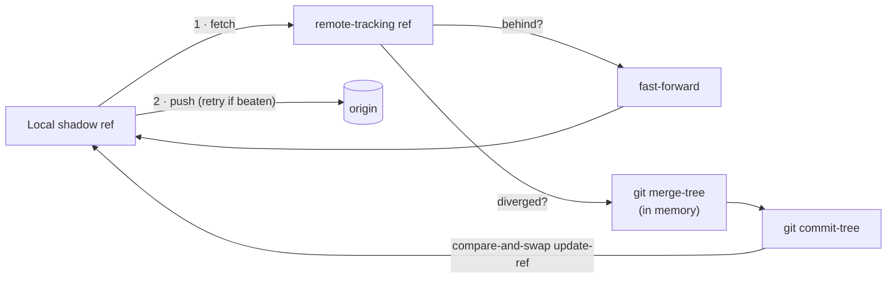

# Sharing traces

By default your captured sessions stay on your machine, on the local
[shadow branch](shadow-branch.md). [`jejak push`](../push.md) shares them to `origin`, and
[`jejak fetch`](../fetch.md) pulls in your teammates' — so a team can pool everyone's traces in one
place without anyone touching their normal branches.

## How the merge works (and why it never touches your code)

The shadow branch is an **orphan ref that is never checked out** — it lives entirely in git's object
store, separate from your working tree. A normal `git merge` needs a checkout, so jejak merges with
pure plumbing instead:

1. **fetch** the remote tip into a remote-tracking ref;
2. compare it to your local ref — if you're behind, fast-forward; if you've diverged,
3. **`git merge-tree`** composes a merged tree in memory, **`git commit-tree`** wraps it, and a
   compare-and-swap **`update-ref`** advances your local ref.

Your branch and working tree are never involved, so syncing traces can't disturb your code.

## Why it's conflict-free

Each developer writes to a **disjoint partition** — `sessions/<your-handle>/…` — so two people's
sessions never collide. On the rare same-path case (e.g. the same session re-captured from two
clones), the seed `.gitattributes` `merge=ours` driver keeps a deterministic copy. The push retries
automatically if someone pushed first, fetching and merging their work before trying again. Nothing
is ever dropped.

## The privacy gate

[Secrets are redacted at capture time](capture.md), before anything is stored. As a second line of
defense, `push` **refuses to run** if your `.jejak/pii.json` custom rules fail to load — jejak won't
publish a trace whose redaction config is broken. (The built-in patterns always apply regardless.)

## See also

- [`jejak push`](../push.md) · [`jejak fetch`](../fetch.md) · [`jejak status`](../status.md) ·
  [The shadow branch](shadow-branch.md) · [How capture works](capture.md)
